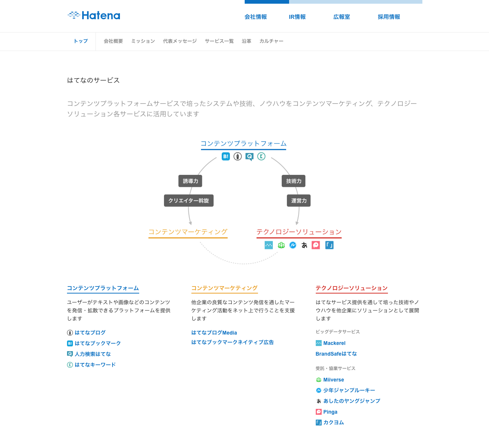

# インターンへようこそ

---

# motemen

* 2008年入社
  * うごメモはてなとか作ってました
* CTO/アプリケーションエンジニア
* 学生に打ち込んだこと: 変愚蛮怒とアイドルマスター
* 最近の趣味はスピードキュービングです
* 困ったらとりあえず motemen を呼んでください

---

# はてなインターン

* 2008年から毎年開催（11年目）
* 志ある学生にウェブサービス開発の経験と成功体験を持ち帰ってもらう
  * 業界にはてなのファンを増やす
* 多くがウェブ業界で活躍中
  * 一部は はてなで活躍中

---

# はてなインターンで持ち帰ってほしいもの

* はてなのウェブサービス開発の体験
* エンジニア仲間とのつながり

---

# カリキュラム

* 前半: ウェブサービス開発の上から下まで
  * ウェブプログラミング（Go）
  * 機械学習
  * インフラ
  * サービス企画・運営
* 後半: 実際のチームで開発

---

# 「サービスを営む」ということ

* 盛りだくさんの講義
  * ウェブサービスを営むのに必要な知識は、プログラミングだけではない
* 企画
* 開発
* 運用

---

# はてなのミッション

「知る」「つながる」「表現する」で新しい体験を提供し、人の生活を豊かにする

---

---

# はてなのエンジニアが大切にしていること

* プロダクト志向
* コラボレーション
* おもしろさ
* 学びとオープンネス

---

# インターン中の心構え

* ハマってる時間はないのでがんがん質問しよう
  * 講師 or メンター or 隣の人
  * 15分同じことしてたら赤信号。自分が訊いたことが他の人にも有用かも
* ハマったことや気付きはどんどん表出させていこう
  * Slack or はてなグループ

---

# 一ヶ月間よろしくお願いします!!!
