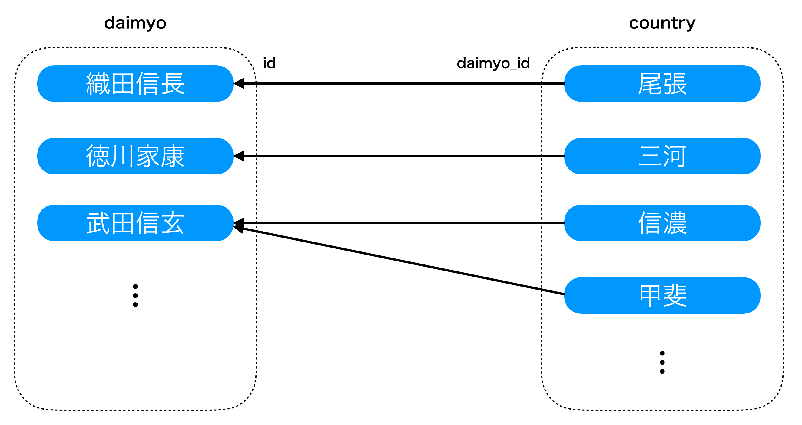
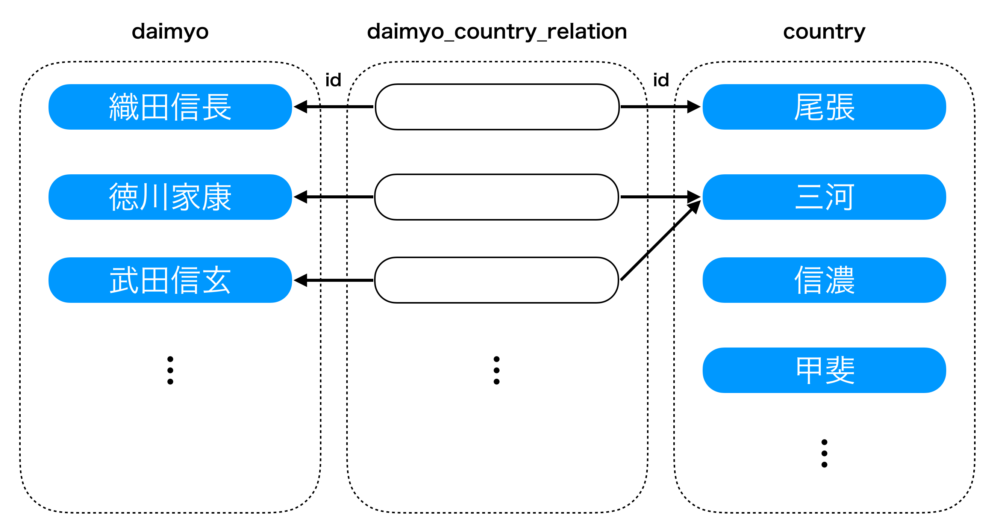

# RDBMS / MySQL

----

# データベース概論

----

## ところで...

- SQLを書いたことありますか?
- プログラミング言語から使ったことがありますか?

----

## データベースとは

- データ(data) = コンピュータが取り扱う情報
- データベース(database) = データを集めて取り扱いやすくしたもの

----

## Webサービスとデータベース

- Webサービスは大量のデータを持つ
    - 例えばはてなブログなら, ブログのデータ, 記事のデータ, カテゴリーのデータ...
- アクセスが増えれば増えるほど, データの書き込み/読み込みが増える
    - それらを捌きながら, サービスは24時間365日運用したい
    - データが消えてしまってはならない
- そのために, データベースを管理するための専用の仕組みを使う
    - データベース管理システム (DataBase Management System = DBMS)

----

## なぜDBMSが必要なのか?

- データを抽象化し, 効率よく保存できる
- 並列アクセスができる
- データ損失を防ぐ

----

### データを抽象化し, 効率よく保存できる

- データを使う人は, データがどのように格納されているか意識しなくても良い
- 用途にあわせて, 最適な構造でデータを保存することができる

----

### 並列アクセスができる

- 同時に書き込み/読み込みが発生した時に齟齬が起きないようにできる
- トランザクション/ロック機構

----

### データ損失を防ぐ

- 停電でサーバがダウンしたりすることもある
- データを書き込んでいる途中でダウンした場合, 書き込みが中途半端に終わる可能性もある
    - そういった際のリカバリーの仕組みを持っている

----

## 様々なデータベース (1)

- リレーショナルDBMS (RDBMS)
    - MySQL, PostgreSQL, SQLite...
    - 今日の講義では, この中のMySQLについて学びます
- カラム指向DBMS
    - BigTable, Apache Cassandra, Apache HBase

----

## 様々なデータベース (2)

- ドキュメント指向DBMS
    - MongoDB, Apache CouchDB, Elasticsearch
- グラフDBMS
    - Neo4j
- キーバリューストア (KVS)
    - Memcached, Redis, Riak

----

# MySQLとは

----

## MySQLについて

- リレーショナルDBMS(RDBMS)の一種
    - RDBMS = 関係モデルに基づいたデータベースの一種
    - 関係モデルについては後述します
- オープンソースで開発されている
- はてなではMackerel以外のほぼ全てのサービスで使われている

----

## 関係モデル

- 関係モデルとは?
    - データを関係として表現し, 取り扱うモデルのこと
- ここでの｢関係｣とは?
    - 属性を持った"組(タプル)"の集合で表される
- 関係において, 差, 和, 直積, 射影, 結合などの演算を数学的に定義できる
- 関係は, わかりやすさのために"テーブル(表)"と呼ばれる

----

### 関係モデルの例

```
R: (ID, 名前, 生年月日) = {
    (1, 織田信長, 1534-06-23),
    (2, 徳川家康, 1543-01-31),
    (3, 武田信玄, 1521-12-01),
    (4, 上杉謙信, 1530-02-18)
}
```

----

### 関係モデルに基づいたデータベース

- = RDBMS
    - データベースは複数の"テーブル(表)"を持つ = 関係
    - データは"レコード(列)"で表される = 組(タプル)
        - レコードは"カラム(属性)"を持つ
- SQLと呼ばれる言語で, テーブルの定義, テーブルに保存されたデータの参照, テーブルに対する演算などを行う事ができる

----

### RDBMSにおけるテーブル

- 例: `daimyo`(大名)テーブル

| id | name     | birthday   |
|:---|:---------|:-----------|
| 1  | 織田信長 | 1534-06-23 |
| 2  | 徳川家康 | 1543-01-31 |
| 3  | 武田信玄 | 1521-12-01 |
| 4  | 上杉謙信 | 1530-02-18 |

----

### RDBMSにおけるテーブル

- 例: `servant`(家来)テーブル

| id | daimyo_id | name       | birthday   |
|:---|:----------|:-----------|:-----------|
| 1  | 1         | 木下藤吉郎 | 1537-03-17 |
| 2  | 2         | 井伊直政   | 1561-03-04 |

----

# SQLとは

----

## SQLとは

- 関係データベースに問い合わせ(操作)を行うための言語
- 標準化されていて, ほとんどのRDBMSで利用可能
    - データの定義
    - データの作成, 読み込み, 更新, 削除

----

## テーブルの定義

----

### `daimyo`テーブルなら...

次のようなSQLで定義される:

```sql
CREATE TABLE daimyo (
  id INTEGER NOT NULL AUTO_INCREMENT,
  name VARCHAR(32),
  birthday DATE,
  PRIMARY KEY(id)
);
```

----

### `servant`テーブルなら...

```sql
CREATE TABLE servant (
  id INTEGER NOT NULL AUTO_INCREMENT,
  daimyo_id INTEGER,
  name VARCHAR(128),
  birthday DATE,
  PRIMARY KEY(id)
);
```

----

### MySQLにおけるデータ型

- 代表的なもの(よく使うもの)を紹介します:
    - 整数型
    - 日付型
    - 文字列型

----

#### 整数型 (1)

- 整数型として`TINYINT`, `SMALLINT`, `MEDIUMINT`, `INT`, `BIGINT`が使える
    - 右のほう程, 大きい整数値を保存できる
    - `UNSIGNED`を付与すると, 符号無しで保存できるようになる(例: `UNSIGNED INT`)
- 桁あふれに気をつける必要がある
    - 例えば, `INT`型は`-2147483648`から`2147483647`の範囲の整数を保存できる
    - しかし, 21億レコードは案外簡単に到達できる

----

#### 整数型 (2)

- `id`などは`BIGINT UNSIGNED`にしておくと安全
    - `18446744073709551615`(1844京)まで保存できる
- 整数型には`AUTO_INCREMENT`属性を指定することができる
    - レコードを保存するとき, 値を指定しなければRDBMSが自動的に採番して値を割り当ててくれる

----

#### 日付型

- 日付型としては, `DATETIME`や`TIMESTAMP`をよく使います
    - `DATETIME`
        - フォーマットは`YYYY-MM-DD HH:MM:SS`
        - 範囲は`1000-01-01 00:00:00`から`9999-12-31 23:59:59`まで
    - `TIMESTAMP`
        - フォーマットは`YYYY-MM-DD HH:MM:SS`
        - 範囲は`1970-01-01 00:00:01`から`2038-01-19 03:14:07`まで

----

#### 文字列型 (1)

- 文字列を保存するための型として, `CHAR`, `VARCHAR`をよく使います
    - `CHAR`
        - 固定長文字列, 0から255文字
    - `VARCHAR`
        - 可変長文字列, 0から65,535バイト

----

#### 文字列型 (2)

- 長い文字列を保存するときには`TEXT`が利用できます
    - `TEXT`
        - 最大65,535バイト
    - `MEDIUMTEXT`
        - 最長16,777,215バイト
    - `LONGTEXT`
        - 最長4,294,967,295

----

### MySQLにおける制約

- `NOT NULL`制約
    - カラムの中身が必ず存在する(`NULL`にならない)ときに付与する
    - `NULL` = データが存在しないことを表す値
- `UNIQUE KEY`制約
    - カラムの中身がテーブル内で一意(重複しない)ときに付与する
- `DEFAULT`制約
    - カラムにデフォルト値を定義したいときに付与する

----

#### データ型と制約を使ったテーブルの定義

- 先程の`daimyo`テーブルを, データ型と制約を使って定義すると...

```sql
CREATE TABLE daimyo (
  `id` BIGINT UNSIGNED NOT NULL AUTO_INCREMENT,
  `name` VARCHAR(32) NOT NULL,
  `birthday` DATE NOT NULL,
  PRIMARY KEY (id),
  UNIQUE KEY (name)
);
```

----

### `PRIMARY KEY`

- テーブル内でレコードを一意に識別できるカラム
    - 1つのテーブルで1つ指定できる / 指定しなくてもよい
- `PRIMARY KEY`は次の制約を満たさないといけない
    - 他のレコードと重複してはいけない(`UNIQUE`制約)
    - 値がなければならない(`NOT NULL`制約)
- `PRIMARY KEY`はインデックス(後述)としても使える

----

### テーブルの削除

- テーブルの削除は`DROP TABLE`でできます
    - 但し｢削除｣なので, テーブルに格納されたデータはすべて消えます

```sql
-- daimyoテーブルの削除
DROP TABLE daimyo;
```

----

### テーブルの変更

- 既存のテーブルにカラムを追加したり, 削除したりするのは`ALTER TABLE`でできます
    - 現状のテーブルと, 理想のテーブルの差分を記述して, それを適用するイメージ

```sql
-- daimyoテーブルにruby(よみがな)テーブルを追加
ALTER TABLE daimyo ADD ruby varchar(32);
```

----

## レコードの操作(CRUD)

- SQLを使って, データベースのデータを操作してみよう
- SQLを使った"操作"のことを"CRUD"とも呼ぶ
    - CREATE(レコード作成), READ(レコード読み込み), UPDATE(レコード更新), DELETE(レコード削除)の頭文字

----

### CREATE

- レコードを追加する

```sql
INSERT INTO daimyo (id, name, birthday) VALUES (5, '毛利元就', '1497-04-16');
INSERT INTO daimyo SET id = 5, name = '毛利元就', birthday = '1497-04-16';
```

----

### UPDATE

- 既に存在するレコードを更新する
    - 更新したいレコードは, `WHERE`で指定する

```sql
UPDATE servant SET name = '羽柴秀吉' WHERE id = 1;
```

----

### DELETE

- 既に存在するレコードを削除する
    - 削除したいレコードは, `WHERE`で指定する

```sql
DELETE FROM daimyo WHERE id = 4;
```

----

### READ

- テーブルからレコードを検索する

```sql
-- daimyoテーブルからIDが1のレコードを検索
SELECT * FROM daimyo WHERE id = 1;

-- daimyoテーブルからIDが1ではないレコードを検索
SELECT * FROM daimyo WHERE id != 1;

-- daimyoテーブルからbirthdayが1530年1月1日以降のレコードを検索
SELECT * FROM daimyo WHERE birthday >= '1530-01-01';
```

----

### `WHERE`節

- READ, UPDATE, DELETEで利用する`WHERE`節について紹介します
    - `WHERE`節では, かなり複雑な条件を組み立てることができるので, この講義ではその中でもよく使うものを中心に取り扱うことにします

----

#### 比較

- SQLにおいて, equalは`=`, not equalは`!=`
- プログラミング言語の数値や文字列のように, `>`, `<`, `>=`, `<=`で比較できる

```sql
-- daimyoテーブルからIDが1のレコードを検索
SELECT * FROM daimyo WHERE id = 1;

-- daimyoテーブルからIDが1ではないレコードを検索
SELECT * FROM daimyo WHERE id != 1;

-- daimyoテーブルからbirthdayが1530年1月1日以降のレコードを検索
SELECT * FROM daimyo WHERE birthday >= '1530-01-01';
```

----

#### `AND`/`OR`/`IN`

- `AND`や`OR`で条件を組み合わせることができる
    - `LIKE`は文字列の部分一致(`%`がワイルドカードで, 任意の0文字以上の文字列になる)
- 同じカラムに対する`OR`は, `IN`でまとめて表現することもできる

```sql
-- daimyoテーブルで, birthdayが1530年1月1日以降で,
-- nameが織田から始まるレコードを検索
SELECT * FROM daimyo WHERE birthday >= '1530-01-01 AND name LINE '織田%';

-- daimyoテーブルで, idが1か2か3のレコードを検索
SELECT * FROM daimyo WHERE id = 1 OR id = 2 OR id = 3;

-- 上のSQLをINを使って表現
SELECT * FROM daimyo WHERE id IN (1, 2, 3);
```

----

#### `ORDER BY`句

- 検索結果をソートしたい時に使う
    - `DESC`は降順, `ASC`は昇順
    - 省略した場合は昇順となる

```sql
- daimyoの全レコードを, birthdayの降順で検索
SELECT * FROM daimyo ORDER BY birthday;

- daimyoの全レコードを, birthdayの昇順で検索
SELECT * FROM daimyo ORDER BY birthday ASC;
```

----

#### `LIMIT`句 / `OFFSET`句

- `LIMIT`句は検索する件数を指定できる
- `OFFSET`句は指定した値だけ検索結果を読み飛ばしてくれる

```sql
-- servantの全レコードから, birthdayの降順で検索して,
-- 5レコード読み飛ばした上で, 3件の検索結果を得る
SELECT * FROM servant ORDER BY birthday LIMIT 3 OFFSET 5;
```

----

#### `GROUP BY`

- `GROUP BY`で, データをグループ化できる
    - 次のSQLでは, `servent`テーブルを使って, `daimyo_id`ごとの`servant`の数(= ある大名に, 何人の家臣がいるか)を求めている
- `COUNT(*)`は, その条件に合致するレコードの数を表示する
- `AS`は, レコードに別名を与えることができる(次のSQLでは`COUNT(*)`の結果を`servant_count`という名前で表示するように指定している)

```sql
-- servantテーブルから, daimyo_idごとのservant数を求める
SELECT daimyo_id, COUNT(\*) AS servant_count FROM servant GROUP BY daimyo_id;
```

----

#### `LEFT JOIN`

- `JOIN`を使うことで, 異なるテーブルに保存されたデータを結合することができる
    - 次のSQLでは, `servant`テーブルの`daimyo_id`と, `daimyo`テーブルの`id`を使って結合している
    - 結果として, `servant`テーブルにある家臣の名前と, その家臣が紐づく(仕えている)`daimyo`テーブルにある大名の名前が表示される

```sql
SELECT servant.name, daimyo.name
    FROM servant LEFT JOIN daimyo ON servant.daimyo_id = daimyo.id;
```

----

## トランザクション処理

- トランザクション = 不可分な処理のまとまり
    - ある一連の処理をするときに, 全部成功 or 全部失敗(取り消し)にしたい
- 例: 銀行の送金
    - AさんからBさんへの10万円の送金は, 次のような2つの処理で実現できる
        - (1) Aさんの口座から10万円引く
        - (2) Bさんの口座に10万円足す
    - もし, (2)の処理だけ失敗してしまうと, Aさんは口座から10万円引かれるだけで終わってしまう

----

### トランザクションとACID特性

- トランザクションに必要な4つの要素
    - Atomicity(原子性) ... 一連の処理は全部実行されるか, 全部実行されないかを保証
    - Consistency(一貫性) ... 一連の処理の結果が整合性を保つことを保証
    - Isolation(独立性) ... 一連の処理について, 外部から結果だけが見ることが出来て, 実行中の状態が他へ影響しないことを保証
    - Durability(永続性) ... 一連の処理について, 処理が完了した段階で結果が失われず, 永続的なものとして保存されていることを保証

----

# より良い設計のために

----

## テーブル間のリレーション

- 異なるテーブルの間で, レコードに関係性を持たせたいときがある
    - 一対多の関係性
    - 多対多の関係性
- このような関係性を持つレコードは, `JOIN`を使って検索することができる

----

### 一対多

----



----

### 一対多

- `country`テーブルは`daimyo_id`カラムを持っている
    - これによって, `country`テーブルにあるレコード(国)が, どの`daimyo`に関連しているか(支配しているか), という関係性を示せる
- 一対多なので, 1つの`country`のレコードには, 1つの`daimyo`しか紐付けることができない


----

### 多対多

----



----

### 多対多

- 1つの国(`country`)を, 複数の大名(`daimyo`)が支配している事もあり得る(多対多)
- その時は, `country`と`daimyo`を関連付けるテーブル(ここでは`daimyo_country_relation`)を用意する
    - `daimyo_country_relation`は, `daimyo`の`id`と`country`の`id`を保存する
    - これによって, 多対多の関係性を示せる

----

## インデックス

- テーブルには, インデックス(索引)を作成することができる
    - インデックスをうまく準備した上で, それを効率的に使うSQLを作れれば, 高速にデータを検索することができる
    - MySQLではB木(B-Tree)というデータ構造が使われる
- デメリットもある
    - レコードを追加/更新/削除する時にインデックスを構築するオーバーヘッドが生じる
    - インデックスを構築した分だけ, テーブルの容量が増える

----

### インデックスの例

- 次の例では, `birthday`カラムについでインデックスを作成している

```sql
-- birthdayカラムについてインデックスを作成
CREATE TABLE daimyo (
  `id` BIGINT UNSIGNED NOT NULL AUTO_INCREMENT,
  `name` VARCHAR(32) NOT NULL,
  `birthday` DATE NOT NULL,
  PRIMARY KEY (id),
  UNIQUE KEY (name),
  KEY (birthday)
);
```

----

### インデックスの例

- レコードが追加される度に, `birthday`カラムでソートがされたインデックスが構築される
- そのため, インデックスがない時に比べて, `birthday`カラムを使ったクエリを高速に検索できる
    - 例: `birthday`の範囲を指定したクエリ
    - `SELECT * FROM daimyo WHERE birthday '1530-01-01' <= birthday && birthday <= '1530-12-31'`

----

# MySQLのパフォーマンス対策

----

## MySQLのパフォーマンス

- RDBMSはスケールしにくい
    - 複数のサーバーで一貫性/可用性を保ちつつデータを分散するのは難しい
- そのため, データベースはWebサービスを開発/運営する上でボトルネックになりやすい
    - うまく対応出来ないとサービスダウンにも繋がる

----

## EXPLAIN

- 推測するな, 計測せよ
    - パフォーマンス対策をする時, 勘で対処してはいけない
    - きちんと計測し, ボトルネックを把握して対処していく必要がある
- MySQLに対する計測には, `EXPLAIN`が有効

```sql
-- 先頭に"EXPLAIN"を付けることで, そのクエリについての情報を得ることができる
EXPLAIN SELECT servant.name, daimyo.name
    FROM servant LEFT JOIN daimyo ON servant.daimyo_id = daimyo.id;
```

----

## パフォーマンス対策のためにできること

- クエリ数に気をつける
    - 1つのクエリで取得できるものは1つのクエリで
    - ループの中でクエリを都度発行しない(いわゆる｢N+1問題｣)
- 不要なクエリは投げない
- 遅くなりがちなクエリに気をつける
    - インデックスを使っていない/うまく活用できていないクエリ
    - 複雑なJOIN, サブクエリ

----

# 今日の講義で話さなかったこと

- 時間の都合上, 以下の内容については割愛しました
    - サブクエリ
    - `DISTINCT`
    - `UNION`句
    - 外部キー(`FOREIGN KEY`)制約
    - トリガー
    - DBMSそのものの構築やユーザー管理, 権限など

----

# 課題

----

## テーブル設計

- `user`テーブル, `diary`テーブル, `article`テーブルを設計してみよう
    - `user`は複数の`diary`を持てるようにしよう
    - `diary`は複数の`article`を持てるようにしよう
- 出来上がったら, 一度メンターにレビューしてもらうと良いでしょう

----

## 機能実装

- 以下の機能を実装してみましょう
    - `diary`を作成する機能
    - `diary`に記事を書く機能
    - `diary`に書かれた記事を読む機能
- 注: 今後の課題でSPA化するので, UI面を作り込みすぎると手戻りが多くなるので気をつけましょう

----

### 想定されるエンドポイント

- 少なくとも, 以下のようなエンドポイントが必要になるでしょう:
    - `GET /diaries/new` ... `diary`の新規登録フォーム
    - `POST /diaries/new` ... 新規登録フォームのリクエストを受け付ける
    - `GET /diaries/:diary_id/new` ... `:diary_id`に対応した`diary`で記事を書くためのフォーム
    - `POST /diaries/:diary_id/new` ... 記事を書くためのフォームのリクエストを受け付ける
    - `GET /diaries/:diary_id/articles/:article_id` ... 個別の記事を見るためのフォーム

----

### 機能実装の進め方

- 一気に実装せず, 1機能ごとに, 次のように作業を分離して進めていくのがオススメです
    - モデル層を作る: `model/`
    - リポジトリ層/サービス層を作る: `repository/`, `service/`
    - Web層を作る: `web/`
    - テンプレートを作成して, ブラウザで見れるようにする

----

## オプション課題

- 余裕があれば, 追加で機能実装をしてみましょう. 例えば...
    - ページング
    - コメント機能(`comment`テーブルを設計して...)
    - 記事を削除する機能
