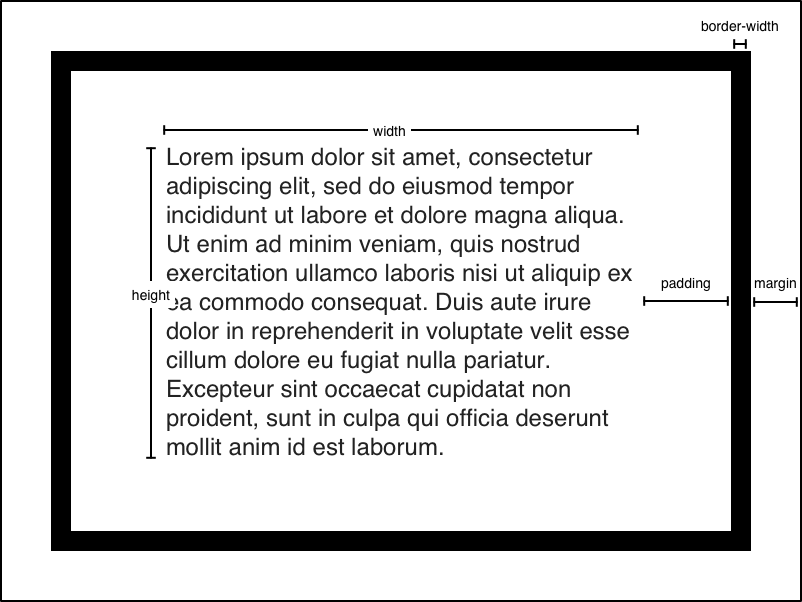

# Webフロントエンド

---

# id:cockscomb

- はてなインターン2012
- ゲームチーム、テックリード
    - イカリング2
- Appleファンボーイ

---

# Webブラウザでうごくページを作ろう

- HTML
- CSS
- JavaScript

---

# HTML

---

# HTML

```html
<!doctype html>
<html lang="ja">
<head>
  <meta charset="UTF-8">
  <title>HTML文書</title>
</head>
<body>
  <h1>HTML文書</h1>
  <p><em>HTML</em>で文書を書いています。</p>
</body>
</html>
```

---

# HTMLはXMLに似ている

```xml
<element attribute="value">text</element>
```

- 要素
- 属性
- テキストコンテント

要素と属性を合わせて「タグ」と呼ぶことがある

Well-formedでなくても許される

---

# HTMLの歴史

- 1993 - HTML 1.0
- ≪第一次ブラウザ戦争≫
- 1997 - HTML 4.0 (1999 4.01)
- 2001 - XHTML 1.1
- ≪第二次ブラウザ戦争≫
- 2014 - HTML 5（WHATWGが提唱しW3Cが策定）
- 2017 - HTML 5.2

---

# Web標準

- W3CのRecommendation
- WHATWGのLiving Standard
- Unicode
- ISO
- IETFのRFC
- IANA

---

# HTML 5の基本的なスニペット

```html
<!doctype html>  <!-- DoctypeでHTML 5文書であることを宣言 -->
<html lang="ja">  <!-- htmlの開始 -->
<head>  <!-- 文書のメタデータをhead要素に -->
  <meta charset="UTF-8">  <!-- 1024 bytes以内にcharsetを宣言 -->
  <title>HTML文書</title>
</head>
<body>  <!-- 文書本文をbody要素に -->
  <h1>HTML文書</h1>
</body>
</html>
```

---

# HTMLでは文書の構造を記述する

- `h1`は見出し
- `p`は段落
- `em`は強調
- `ol`は順序付きリスト

数多くの要素がある[^1]

[^1]: [HTML elements reference - HTML: HyperText Markup Language | MDN](https://developer.mozilla.org/en-US/docs/Web/HTML/Element)

---

# HTMLの要素のセマンティクス

HTML要素には意味がある

- `article`, `section`, `header`, `footer`, `aside`, `nav`, `h1`, `p`, `figure`, `img`, `code` ...

意味と関係なく使える要素もある

- `div`, `span`

---

# セマンティクスに従うとコンピュータにとって扱いやすい

- アクセシビリティ
- SEO
- かっこよさ

---

# HTMLの要素はコンテンツカテゴリ[^2]で分類

- Flow content
- Heading content
- Sectioning content
- Phrasing content
- etc

`h1`要素はphrasing contentを内包できる、などと決まっている

[^2]: [Content categories - Developer guides | MDN](https://developer.mozilla.org/en-US/docs/Web/Guide/HTML/Content_categories)

---

# ブロックレベル要素とインライン要素

HTML 4までは、*ブロックレベル要素* や *インライン要素* のように区別していた

- ブロックレベル要素
    - 矩形を作る
    - Flow contentに相当
- インライン要素
    - 行内に入る
    - Phrasing contentに相当

---

# CSS

---

# CSS

```css
* {
  font-family: 'sans-serif';
}

h1 {
  font-size: 2rem;
}

p em {
  font-weight: bold;
}
```

---

# CSSは文書の見た目を変化させる

```css
selector {
  property: 'value';
}
```

セレクタで要素を特定する

プロパティに値を設定して見た目を操作する

---

# CSSのセレクタ[^3]

- 単純セレクタ `p`, `.class`, `#id`
- 属性セレクタ `[attr]`, `[attr=value]`, `[attr~=value]`
- 擬似クラス `:hover`, `:visited`, `:first`, `nth-child()`, `:not()`
- 擬似要素 `::before`, `::after`, `::first-line`, `::first-letter`, `::selection`
- 結合子 `A, B`, `A B`, `A > B`, `A + B`, `A ~ B`

[^3]: [Selectors - Learn web development | MDN](https://developer.mozilla.org/en-US/docs/Learn/CSS/Introduction_to_CSS/Selectors)

---

# CSSの値

- 数値 `0`, `8px`, `8mm`, `8pt`, `1em`, `1rem`, `1vh`, `1vw`, `90deg`, `0.4s`, `50%`
- 色 `#ffffff`, `rgba(255, 255, 255, 1.0)`, `hsl(0, 100%, 100%)`
- 関数 `calc(100% - 16px)`

---

# CSSのカスケード

```html
<div id="css" class="parent">
  <div class="child">
    Cascading Style Sheets
  </div>
</div>
```

```css
#css {
  color: blue;
}
.parent {
  font-size: 14px;
  color: red;
}
.child {
  font-size: 18px;
}
```

---

# CSSの詳細度による優先順位[^4]

- `style`属性 × 1000
- IDセレクタ × 100
- クラスセレクタ、属性セレクタ、擬似クラス × 10
- 要素セレクタ、擬似要素 × 1

後に書かれたものの方が優先

`!important`はさらに強い

[^4]: [Specificity - CSS: Cascading Style Sheets | MDN](https://developer.mozilla.org/en-US/docs/Web/CSS/Specificity)

---

# ボックスモデル



---

# ボックスモデル[^5]


[`box-sizing`](https://developer.mozilla.org/en-US/docs/Web/CSS/box-sizing)で挙動を変えられる

[^5]: [Introduction to the CSS basic box model - CSS: Cascading Style Sheets | MDN](https://developer.mozilla.org/en-US/docs/Web/CSS/CSS_Box_Model/Introduction_to_the_CSS_box_model)

---

# レイアウト[^6]

- 回り込み
    - `float: left;`, `float: right;`, `clear: both;`
- Positioned
    - `position: relative;`, `position: absolute;`, `top: 0px;`, `left: 0px;`
- Flexible box
    - `display: flex;`
- Grid
    - `display: grid;`

[^6]: [Layout mode - CSS: Cascading Style Sheets | MDN](https://developer.mozilla.org/en-US/docs/Web/CSS/Layout_mode)

---

# CSS preprocessor

- [LESS](http://lesscss.org)
- [SASS/SCSS](https://sass-lang.com)

CSSを拡張した記法

---

# CSS processer

- [PostCSS](https://postcss.org)

CSSを解析して加工するためのツール（記法の拡張もできる）

- ベンダープリフィックス（`-webkit-`, `-moz-`）を自動で付与
- CSS Variables（`--variable`）を展開

---

# JavaScript

---

# JavaScript

ECMAScript 2017

Webページに動きをつけられる

---

# DOM

HTML/XMLをプログラムから操作する仕組み

```typescript
export function initializeFizzBuzz(container: HTMLOListElement, button: HTMLButtonElement): void {
  const fizzBuzz = new FizzBuzz();

  button.addEventListener('click', evt => {
    const listItem = document.createElement('li');
    listItem.textContent = fizzBuzz.value;

    container.appendChild(listItem);

    fizzBuzz.increment()
  });
}
```

---

- `Node`
  - `Document`
  - `Element`
    - `HTMLElement`
      - `HTMLParagraphElement`
  - `Attr`
  - `CharacterData`
    - `Text`
      - `CDATASection`
    - `Comment`

---

# JavaScriptの歴史

- 1996 - JavaScript 1.0/JScript 1.0
- 1999 - JavaScript 1.5/ECMAScript 3.0
- 2011 - ECMAScript 5.1
- 2015 - ECMAScript 2015
  - class, module
- 2017 - ECMAScript 2017

---

# JavaScript Transpiler

- [Babel](https://babeljs.io) (2014)
- AltJS
  - [CoffeeScript](https://coffeescript.org) (2009)
  - [TypeScript](https://www.typescriptlang.org) (2012)
  - [Flow](https://flow.org) (2014)

---

# TypeScript

JavaScriptのスーパーセットとして、型アノテーションを加えた

JavaScriptにtranspileすると型情報が消えるため、実行時の型チェックはできない

サードパーティのライブラリも、型定義ファイルがあればそれを参照する

---

# 型定義ファイル

- ライブラリに付属している
- [DefinitelyTyped](http://definitelytyped.org)のパッケージを`@types/*`としてインストール

---

# Package Manager

- [npm](https://www.npmjs.com)
  - `package.json`, `package-lock.json`
- [Yarn](https://yarnpkg.com)
  - `package.json`, `yarn.lock`

機能差は減っている

---

# Yarn

- `yarn init` - 初期化
- `yarn add [package]` - パッケージの追加
- `yarn add [package] --dev` - 開発用パッケージの追加
- `yarn upgrade [package]`- パッケージの更新
- `yarn remove [package]` - パッケージの除去
- `yarn install` - パッケージのインストール

---

# JavaScript Module

- CommonJS Modules
  - `module.exports = function () { return 0; };`
  - `const foo = require('foo');`
- AMD
  - `require(['foo'], function(foo) {});`
  - `define(function () { return 0; );`
- ES2015 Modules
  - `export const foo = function () { return 0; };`
  - `import { foo } from 'foo';`

---

# Module bundler

依存を解決してmoduleを結合する

- [Browserify](http://browserify.org)
- [Webpack](https://webpack.js.org)
  - Loaderで拡張することでJavaScript以外にも利用できる
- [rollup.js](https://rollupjs.org/guide/en)

---

# Webpack

## `webpack.config.js`

```javascript
module.exports = {
  mode: "development",
  devtool: "inline-source-map",
  entry: "./src/index.ts",
  output: {
    filename: "index.js"
  },
  resolve: {
    extensions: [".ts", ".tsx", ".js"]
  },
  module: {
    rules: [
      { test: /\.tsx?$/, loader: "ts-loader" }
    ]
  }
};
```
---

```javascript
module.exports = {
  mode: "development",
  devtool: "inline-source-map",
  entry: "./src/index.ts",
  output: {
    path: path.resolve(__dirname, '../static'),
    filename: '[name].js',
    publicPath: '/static/',
  },
  resolve: {
    extensions: ['.ts', ".tsx", ".js"],
  },
  module: {
    rules: [
      {
        test: /\.tsx?$/,
        use: 'ts-loader',
      },
      {
        test: /\.scss$/,
        use: [
          MiniCssExtractPlugin.loader,
          'css-loader',
          'sass-loader',
        ],
      },
      {
        test: /\.(png|jpe?g|gif|svg)$/,
        use: [
          {
            loader: 'file-loader',
          },
        ],
      },
    ],
  },
  plugins: [
    new MiniCssExtractPlugin({
      filename: '[name].css',
    }),
  ],
}
```

---

# Webpackのloaderの例

- [`ts-loader`](https://github.com/TypeStrong/ts-loader): TypeScript
- [`css-loader`](https://github.com/webpack-contrib/css-loader): CSS
- [`sass-loader`](https://github.com/webpack-contrib/sass-loader): SASS/SCSS
- [`file-loader`](https://github.com/webpack-contrib/file-loader): ファイル一般

---

# Single-page application

---

# うごくWebページの概念的発展

- 1997 - Dynamic HTML
- 2005 - Ajax
  - prototype.js (2005)
  - GWT (2006)
  - jQuery (2006)
- Single-page application
  - AngularJS (2009)
  - React (2013)
  - Vue.js (2014)

---

# Dynamic HTML

Webページにうごきがつけられる

DOM APIが整備された

JavaScriptが無効に設定される

---

# Ajax

`XMLHttpRequest`によりWeb APIを呼び出すことが可能に
（いまはさらにFetch APIが使える）

`JSON`フォーマットが登場

Googleマップなどと共にAjaxの概念が普及

ブラウザの実装差異を埋めるため、種々のライブラリが出回る

---

# Single-page application

実際のページ遷移を伴わずにアプリケーションを提供する

DOM操作とAjaxの結晶

---

# その先へ

Progressive Web Apps

---

# React

---

# [React](https://reactjs.org)

## 宣言的

DOMの状態はアプリケーションの状態の写像

## コンポーネント志向

カプセル化された状態を保持する再利用可能なコンポーネント

---

# Stateless Component

```javascript
interface TimestampProps {
  timestamp: Date;
}
const Timestamp: React.StatelessComponent<TimestampProps> = ({ timestamp }) => (
  <time dateTime={timestamp.toISOString()}>
    {new Intl.DateTimeFormat().format(timestamp)}
  </time>
);
```

---

# Pure Component

```javascript
interface RecordsState {
  timestamps: Date[];
}
class Records extends React.PureComponent<{}, RecordsState> {
  state = { timestamps: [] as Date[], };

  record = () => {
    const now = new Date();
    this.setState(({timestamps}) => ({ timestamps: [now, ...timestamps], }));
  };

  render(): React.ReactNode {
    return (
      <div>
        <button onClick={this.record}>Record</button>
        <ol>
          {this.state.timestamps.map(timestamp => <li key={timestamp.getTime()}><Timestamp timestamp={timestamp} /></li>)}
        </ol>
      </div>
    );
  }
}
```

---

# PropsとState

- Props
  - コンポーネントに外から与えるパラメータ
  - 関数スタイルなら引数、classスタイルなら`this.props`
- State
  - コンポーネントの内部で持つ状態
  - `this.state`から取得
  - `this.setState()`で更新できる

---

# Stateの更新

```typescript
setState<K extends keyof S>(
  state:
    ((prevState: Readonly<S>, props: Readonly<P>) => (Pick<S, K> | S | null)) |
    (Pick<S, K> | S | null),
  callback?: () => void
): void;
```

- 現在の状態をもとに次の状態を作る関数
- 次の状態

のどちらか

Stateの更新は内部的に、少し遅延して（まとめて）評価される可能性がある

---

# コンポーネント

- Component
  - classスタイル
  - 状態を持てる
- PureComponent
  - 通常のcomponentに最適化を加えたもの
- StatelessComponent
  - 関数スタイル
  - 状態を持たない

---

# PureComponentの最適化

Propsやstateが更新されたときに`===`で比較

変化があった場合にのみ`render()`関数が呼ばれる

Propsやstateをimmutableに扱うことでパフォーマンスを改善できる

---

# スプレッド構文

```typescript
const obj = { a: 'a' };
obj['b'] = 'b';
```

ではなく

```typescript
const obj = { a: 'a' };
const obj2 = {
    ...obj,
    b: 'b',
};
```

---

# スプレッド構文

```typescript
const arr = [ 'a' ];
arr.push('b');
```

ではなく

```typescript
const arr = [ 'a' ];
const arr2 = [...arr, 'b'];
```

---

# JSX (TSX)

```html
<Component propsName={propsValue}>
  {children}
</Component>
```

コンポーネントをHTMLに似た構文で生成できる

`class`属性が`className`になるなど、いくつかの違いがある

JSXの中でもJavaScriptの式を書ける

---

# Reconciliation

実際のDOMの操作は深刻なパフォーマンスの劣化を引き起こす可能性があるので、最小限にしたい

`render()`の結果は仮想DOMになる

仮想DOMと実際のDOMを比較して、必要な枝葉のみを更新する

---

# Reconciliation

```html
<li key={timestamp.getTime()}>...</li>
```

1. ヒント情報を比較
  1. Componentの種類
  2. `key` props
2. Propsを比較
3. 同じなら下位のcomponentへ
4. 異なっていれば更新

---

# Context

```javascript
enum Theme {
  LIGHT = 'light',
  DARK = 'dark',
}

const ThemeContext = React.createContext(Theme.LIGHT);

const App: React.StatelessComponent = () => (
  <ThemeContext.Provider value={Theme.DARK}>
    <ThemedButton>Button</ThemedButton>
  </ThemeContext.Provider>
);

const ThemedButton: React.StatelessComponent<React.ButtonHTMLAttributes<HTMLButtonElement>> = (props) => (
  <ThemeContext.Consumer>{
    (theme) => (
      <button {...props} className={[theme, props.className].join(' ')} />
    )
  }</ThemeContext.Consumer>
);
```

---

# React関連ライブラリ

---

# [React Router](https://github.com/ReactTraining/react-router)

Reactでルーティングする

```javascript
import React from "react";
import {BrowserRouter, Route, Switch} from "react-router-dom";

import {Entry} from "./entry";
import {Index} from "./index";

export const App: React.StatelessComponent = () => (
  <BrowserRouter>
    <main>
      <Switch>
        <Route exact path="/" component={Index} />
        <Route exact path="/entry/:entryId" component={Entry} />
      </Switch>
    </main>
  </BrowserRouter>
);
```

---

# React Router

```javascript
import React from "react";
import {RouteComponentProps} from "react-router";

interface RouteProps {
  entryId: string
}

export const Entry: React.StatelessComponent<RouteComponentProps<RouteProps>> = ({ match }) => (
  <article className="Entry">
    {match.params.entryId}
  </article>
);
```

---

# [React Apollo](https://github.com/apollographql/react-apollo)

GraphQL client

```javascript
import React from "react";

import {ApolloProvider} from "react-apollo";
import ApolloClient from "apollo-client";
import {HttpLink} from "apollo-link-http";
import {InMemoryCache} from "apollo-cache-inmemory";

const client = new ApolloClient({
  link: new HttpLink({
    uri: 'http://localhost:8000/graphql',
    credentials: 'same-origin',
  }),
  cache: new InMemoryCache(),
});

export const App: React.StatelessComponent = () => (
  <ApolloProvider client={client}>

  </ApolloProvider>
);
```

---

# React Apollo

```javascript
import React from "react";
import {Query} from "react-apollo";
import gql from "graphql-tag";

import {EntryList, entryListFragment} from "./entries";
import {ListEntries} from "./__generated__/ListEntries";

const query = gql`query ListEntries {
  listEntries {
    ...EntryListFragment
  }
}
${entryListFragment}
`;

export const Index: React.StatelessComponent = () => (
  <Query<ListEntries> query={query}>
    {result => {
      if (result.error) {
        return <p className="error">Error: {result.error.message}</p>
      }
      if (result.loading) {
        return <p className="loading">Loading</p>
      }
      return <EntryList entries={result.data!.listEntries} />;
    }}
  </Query>
);
```

---

# 課題

---

# 課題

インターンブログをSingle-page applicationにしよう

- GraphQL APIをApolloを使って利用する
- React Routerで色々なページを作ってみる

機能

- 記事一覧
- 記事の投稿

---

# 課題

## STEP 1

- ライブラリを追加
    - `yarn add react`
    - `yarn add @types/react --dev`
- [ページにReactを追加](https://reactjs.org/docs/add-react-to-a-website.html)

---

# 課題

## STEP 2

- [Apolloを使ってクエリを投げてみる](https://www.apollographql.com/docs/react/essentials/get-started.html)
- [React Routerでページを増やす](https://reacttraining.com/react-router/web/guides/quick-start)
- [Mutationで記事を投稿できるようにする](https://www.apollographql.com/docs/react/essentials/mutations.html)

---

# 課題

## STEP 3

好きな機能を作ろう！
