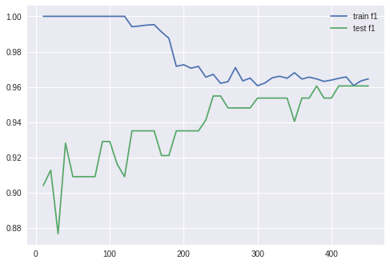

# 機械学習 基礎編

---

# id:alpicola


- 2017年入社
- ブックマークチーム
- 学生時代はプログラミング言語の理論研究

---

# 目次

- **機械学習とは ☜**
- 分類問題の解き方
- 学習結果の評価と改善

---

# 機械学習とは

1. 過去のデータからデータの傾向を**学習**
2. 未知のデータの性質を**予測**

---

# 機械学習の種類

- 教師あり学習 (supervised learning) ：正解が与えられている
    - 回帰 (regression) ：量的変数を予測
    - 分類 (classification) ：質的変数を予測
- 教師なし学習 (unsupervised learning) ：明示的な正解はない

---

# Webサービス開発での教師あり学習の例

- コンテンツの分類：投稿が特定の話題に関するものかどうか
- スパムフィルター：投稿がスパムかどうか

^ Q. これらは回帰ですか分類ですか

---

# Webサービス開発での教師なし学習の例

- 話題の抽出：多数の投稿から似た話題のクラスタを見つける
- サーバーの異常検知：通常時と大きく異なるサーバーの状態を検出

---

# 目次

- 機械学習とは
- **分類問題の解き方 ☜**
- 学習結果の評価と改善

---

# 分類問題

- 頻繁に登場する問題設定
- この講義でも分類問題を主に扱う

---

# 例：スパムフィルター

どうやってスパム投稿かどうか判断する？

---

# 素朴なアプローチ（NGワード）

- 特定の単語が入った投稿をスパムとみなす
    - 「激安」など
- とても気をつけて単語を選ばないと、誤判定しがち

---

# 線形和によるアプローチ

- 単語ごとに「スパムっぽさ」を表すスコアを設定
- 単語 $$i$$ のスコアを $$w_i$$ 、入力中の出現頻度を $$x_i$$ として $$\sum_i w_i x_i > 0$$ ならスパムと判定

---

# 線形和によるアプローチ

例：「サングラス　激安」

| $$i$$   | 激安 | 無料 | めがね| サングラス | 
| ------- | ---- | ---- | ----- | ---------- |
| $$w_i$$ | 20   | 10   | -10   | -5         |
| $$x_i$$ | 1    | 0    | 0     | 1          |

スコアの和が $$20 \cdot 1 + (-5) \cdot 1 = 15 > 0$$ だからスパムと判定

---

# 分類モデル

$$
x \overset{\mathrm{in}}{\longrightarrow} \boxed{\hphantom{sp}f\hphantom{sp}} \overset{\mathrm{out}}{\longrightarrow} y
$$

- 特徴ベクトル：$$\boldsymbol{x} = (x_1, \dots, x_m)$$
    - ここでは $$x_i$$ はそれぞれの単語の出現頻度
- 分類ラベル：$$y \in \{1, -1\}$$
    - $$1$$ がスパムを表す

---

# 分類モデル

$$
x \overset{\mathrm{in}}{\longrightarrow} \boxed{\hphantom{sp}f\hphantom{sp}} \overset{\mathrm{out}}{\longrightarrow} y
$$

- モデル：$$f$$
    - 特徴量 $$\boldsymbol{x}$$ を受け取って、予測結果 $$y$$ を返す「賢い箱」

---

# 線形の分類モデル

$$
f(\boldsymbol{x}) = \mathrm{sign}(\boldsymbol{w}\cdot\boldsymbol{x}) = \mathrm{sign}\left(\sum_{i=0}^{m}w_{i}x_{i}\right)
$$

$$
\mathrm{sign}(a) = 
\begin{cases}
1  & \text{if } a > 0 \\
-1 & \text{otherwise}
\end{cases}
$$

- 重みベクトル：$$\boldsymbol{w} = (w_0, w_1, \dots, w_m)$$
- 特徴ベクトル：$$\boldsymbol{x} = (1, x_1, \dots, x_m)$$

---

# パーセプトロン

- 線形モデルの重み $$\boldsymbol{w}$$ を学習するアルゴリズムの一つ

---

# パーセプトロン

1. 適当な重みの初期値 $$\boldsymbol{w}^{(0)}$$ を設定 
2. 訓練データ $$(\boldsymbol{x}_1, y_1) \dots, (\boldsymbol{x}_n, y_n)$$ に対し次のように重みを更新

$$
\boldsymbol{w}^{(t+1)} = \begin{cases}
\boldsymbol{w}^{(t)} & \text{if } y_if(\boldsymbol{x}_i) > 0 \\
\boldsymbol{w}^{(t)} + \eta y_i\boldsymbol{x}_i & \text{otherwise}
\end{cases}
$$

( ˘⊖˘) 。o（予測が間違っていたら、特徴量の分だけ調整）

---

# パーセプトロン

- 初期値 $$\boldsymbol{w}^{(0)}$$ は零ベクトルにすることが多い
- ハイパーパラメーター $$\eta$$ は学習幅を表す
    - 普通は $$1$$ でよい
- ステップ2は適当な回数繰り返す
    - 回数は決め打ち、もしくは予測を間違える訓練標本の数が十分少なくなるまで

---

# 目次

- 機械学習とは
- 分類問題の解き方
- **学習結果の評価と改善 ☜**

---

# 分類モデルの評価

- 学習に使ったデータが正しく分類できるのは当たり前
- 本当に興味があるのは、未知のデータに対してもうまくいくか
    - 未知のデータに対する真の性能を汎化性能と呼ぶ

---

# 訓練データとテストデータ

- 手元のデータを訓練データとテストデータに分割
    - 訓練データで学習
    - テストデータをどれだけ正しく分類できるかで評価

---

# 交差検定 (cross-validation)

- k分割交差検定：
    - データをk個のグループに分割
    - うち1個をテストデータ、残りを訓練データに使う
    - 全kパターンでのスコアの平均をとったもので性能評価
- 交差検定の結果に基づいてよいモデルを選択

---

# 学習曲線による分析

- 横軸：訓練データ数
- 縦軸：訓練データとテストデータの精度（F値など、後述）

---

# 理想的な状態



訓練データの精度がテストデータの精度が近い高めの値に収束

---

# 適合不足 (underfitting)

- 訓練データの精度、テストデータの精度ともに低い
- 訓練データから十分に学習できていない状態
- 改善策：
    - 訓練データを増やす
    - 特徴量を加える
    - より表現力のある複雑なモデルを使う

---

# 過学習 (overfitting)

- 訓練データの精度は良いが、テストデータの精度が悪い
- 訓練データに過剰に適合してしまっている状態
- 改善策：
    - 訓練データを増やす
    - モデルの複雑度を下げる（正則化）

---

# 分類モデルの評価指標

- 正解率 (accuracy)
- 適合率 (precision)
- 再現率 (recall)
- F値 (F<sub>1</sub> score)

---

# 例：スパムフィルター

- スパムフィルターA：50%のスパムを捕捉（誤判定なし）
- スパムフィルターB：なんでもスパム扱い

---

# 例：スパムフィルター

- もしスパムの割合が80%だと……
    - スパムフィルターAの正解率：60%
    - スパムフィルターBの正解率：80%
- クラス比に偏りがあると、正解率だけではモデルの良さを評価できない

---

# 混同行列 (confusion matrix)

|        | 正と予測            | 負と予測            |
| ------ | ------------------- | ------------------- |
| **正** | true positive (TP)  | false negative (FN) |
| **負** | false positive (FP) | true negative (TN)  |

---

# スパムフィルターA

|        | 正と予測 | 負と予測 |
| ------ | -------- | -------- |
| **正** | 40       | 40       |
| **負** | 0        | 20       |

---

# スパムフィルターB

|        | 正と予測 | 負と予測 |
| ------ | -------- | -------- |
| **正** | 80       | 0        |
| **負** | 20       | 0        |

---

# 適合率

正と予測したうちの、実際に正例だった割合

$$
\mathrm{precision} = \frac{TP}{TP + FP}
$$

- $$TP$$：予測結果も実際のラベルも正 (true positive) の数
- $$FP$$：予測結果は正だが実際のラベルは負 (false positive) の数

^ スパムフィルターA, Bの適合率は？

---

# 再現率

データの正例のうちの、正と予測した割合

$$
\mathrm{recall} = \frac{TP}{TP + FN}
$$

- $$TP$$：予測結果も実際のラベルも正 (true positive) の数
- $$FN$$：予測結果は負だが実際のラベルは正 (false negative) の数

---

# F値

適合率と再現率の調和平均をとってバランスよく評価

$$
F_1 = 2 \cdot \frac{\mathrm{precision} \cdot \mathrm{recall}}{\mathrm{precision} + \mathrm{recall}}
$$

---

# 適合率、再現率、F値

- 適合率と再現率はトレードオフ
- どちらを優先するかはタスクにより様々
    - スパムフィルターなら再現率より適合率を重視？
- 分類モデルの性能をざっと見る指標としてはF値を使うことが多い 

---

# 課題

---

# 課題1：分類モデルの評価指標

- `intern_ml.metrics` モジュールの各関数を実装しましょう
    - `accuracy_score`
    - `precision_score`
    - `recall_score`
    - `f1_score`

---

# 課題2：パーセプトロンの実装と性能評価

- `intern_ml.perceptron` モジュールにあるパーセプトロン実装の雛形を完成させてください

---

# 課題2：パーセプトロンの実装と性能評価

- 性能評価にはirisデータセット (`data/iris.data`) を使います
    - ラベルは3値ありますが、ここでは `Iris-setosa` を正、それ以外を負としてください
- データセットを訓練セットとテストセットに分割し、学習曲線を書きましょう
    - 分割比は2:1など、データは分割前にシャッフルしておきましょう
    - 訓練セットでのF値とテストセットでのF値をプロットしてください

---

# 課題3：多値分類（オプショナル）

- irisデータセットで `Iris-vergicolor` や `Iris-virginica` を正とした学習も試してみましょう
    - 他の分類モデルや特徴量の追加（明日の講義で扱います）も検討してみましょう
- それぞれのラベルの2値分類器を組み合わせることにより3値分類器を実装してみましょう（1-vs.-allなどと呼ばれる方法）

---

# Appendix

---

# matplotlibで学習曲線の描画

`n_train`：訓練セットのサイズのリスト
`train_scores` ：訓練セットのスコアのリスト
`test_scores` ：テストセットのスコアのリスト

```
import matplotlib.pyplot as plt
plt.plot(n_train, train_scores, label='train')
plt.plot(n_train, test_scores, label='test')
plt.legend()
plt.show()
```

---

# matplotlibで学習曲線の描画

Jupyter Notebook上なら

```
%matplotlib inline
```

しておくと、その場で表示してくれる

もしくは

```
plt.savefig('learning_curve.png')
```

でファイルに保存する

---

# matplotlibで日本語表示

DockerイメージにIPAフォントをインストールしてあるので

```
plt.rcParams['font.sans-serif'] = 'IPAGothic'
```
