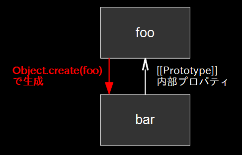
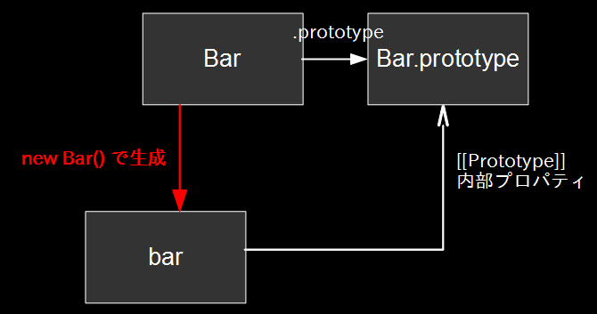
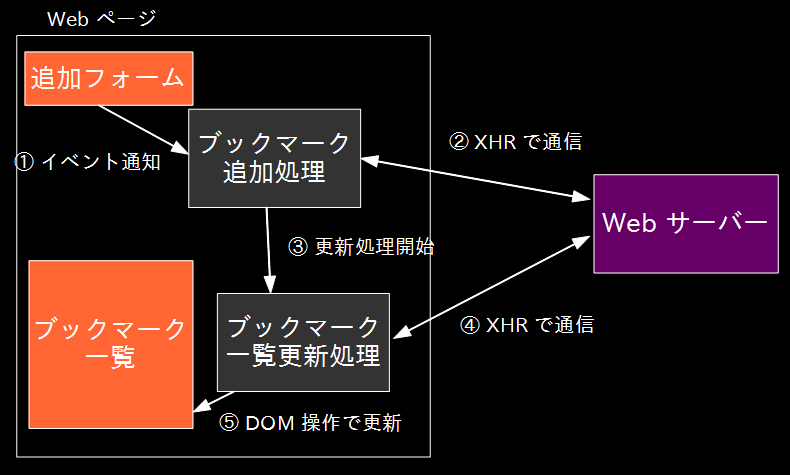

# JavaScript によるイベントドリブン

## 目的

講義時間は限られているので

* JS を学ぶ上でとっかかりをつかめること
  * 自分で調べて学んでいけるように基礎知識をつける
* 言語コア部分、DOM 及びイベントドリブンなプログラミング
* みんな使うであろう jQuery

覚えようとするとクソ多いのでリファレンスひける部分は覚えない

## JS、HTML、CSS あたりの情報を (web 上で) 調べるときに困ること

* 処理系によって違う部分が多い
* 変化が激しい
  * 数年前の情報があてにならないこともある (古い)
* 誤った情報とか参考にすべきでない情報もある

### どうするか?

* 基礎的な知識を身につける (信頼できそうかどうか判断できるように)
* ある程度参考にできるサイトを見る

## クロスブラウザについて

* 多くの処理系があるので、あらゆる環境に対応するのは難しい
  * クロスブラウザ対応はバッドノウハウの塊みたいなもの
  * 本質的ではない
* ここでは最新の Firefox や Chrome を使って開発することを前提に

## 最初に JS のデバッグ方法の確認

* 事前課題の JS-0 で開発ツール使えた?
* いま適当なページで開発ツールを使ってみよう
  * HTML 構造を見る、適用されている CSS を見る
  * ページ上のコンテキストで JS を実行 (`document.body.innerHTML = ""`)
* スクリプトを中断する場所 (ブレークポイント) を指定でき、そこから1行ずつ実行できる
  * スクリプト中に <code>debugger;</code> と書いておけばそこで中断する
* <code>console.log()</code>
  * 最近のブラウザなら使える
* <code>alert()</code>
  * 古典的だが今でも役に立つこともある
  * その時点で処理がブロックするので、ステップをひとつずつ確認するとき便利
  * スマートフォンや携帯ゲーム機などデバッガが無い場合

## 話の流れ

* JavaScript の言語コア部分
  * 構文とかとか
* Web と JS にまつわるあれこれ
  * HTML、CSS
  * DOM Core
  * DOM Events
  * XMLHttpRequest
  * など
* クライアントサイド MVC
* jQuery

## まずは JS の言語コア部分の話

* 事前課題で軽く勉強してもらっているはず
  * 駆け足気味に進めるので速すぎるなら止めて
* 言語コア部分は ECMAScript として標準化されている
  * [ECMAScript](http://www.ecmascript.org/)
  * [JavaScript 言語情報 (MDN)](https://developer.mozilla.org/ja/docs/Web/JavaScript/Language_Resources)

## 歴史

* 参考に: [JavaScript History](https://www.slideshare.net/badatmath/js-shistory)

## JS が使われる場所
* 基本的にはブラウザ上の処理だが、処理系がたくさんあり、最近では色んな所で使われている
  * node.jsでサーバサイドがjsで書ける
  * Bower、Gruntなどの開発ツールもnode.jsでできている
  * node-webkit使えばデスクトップで動作するクロスプラットフォームなアプリが書ける
  * スマフォアプリも書ける (Windows Phone、Firefox OS などではネイティブでサポート、Titanium、PhoneGap なども)
* Web アプリケーションにはほぼ必須
  * はてなのエンジニアはみんな誰もがある程度書ける
* フロントエンドのこまめなおもてなし
  * ページの一部だけを読み込んで待たせないとか

今日の話は web ブラウザ上で使うことを前提にする。

# JavaScript 言語について

## 言語的特徴

* 変数に型なし
* 値に型はある
  * プリミティブな型 + オブジェクト型
* 関数も値 (オブジェクト)
* C-like な文法
* Perlとちがってコンテキストは無い
* 言語のコア部分は ECMAScript として標準化されている
  * <a href="https://developer.mozilla.org/ja/JavaScript/Guide/JavaScript_Overview#JavaScript_.E3.81.A8_ECMAScript_.E4.BB.95.E6.A7.98">JavaScript と ECMAScript 仕様について (JavaScript Overview - MDN)</a>
  * ECMAScript 仕様は <a title="Standard ECMA-262 Edition 5.1" href="http://ecma-international.org/ecma-262/5.1/">ECMA-262 (5.1)</a> (日本語版 : <a href="http://www2u.biglobe.ne.jp/~oz-07ams/prog/ecma262r3/">ECMA-262 3rd 日本語版</a>)
  * ActionScript も同じ。AS やったことあるなら JS は DOM さえ覚えれば良い
* プロトタイプベースの継承構造をサポートしており, クラスというものはない
  * クラスベースの継承を模倣することはできる

ひとつずつ説明していきます

## コメントとソースコード中の文字のエスケープシーケンスでの表現

* Unicode エスケープシーケンスに注目: `\uXXXX`
  * UTF-16
  * そういえばそもそも Unicode って知ってる?

```javascript
// 一行コメント

/*
 * 複数行コメント
 */

// `\uXXXX` 形式でソースコード中の文字を表せる
// 普通は変数名に使うことはしないが、文字列リテラル内に書くことはよくある
var \u0041 = "`\u0041` という変数名";
A; //=> "`A` という変数名"
```

## 変数と値

* 変数に型なし
* 値に型はある
  * プリミティブな型 + オブジェクト型
* 関数も値 (オブジェクト)

## 変数に型なし

Perl と一緒で、Java や C などと違う点

```javascript
var foo = ""; // 文字列
foo = 1;      // 数値
foo = {};     // オブジェクト
```

## 値の型

Ruby のように 「すべての値はオブジェクト」 ではない。 Java のようにプリミティブ値あり。

* Undefined 型
* Null 型
* Number 型
* Boolean 型
* String 型
* Object 型

Object 型以外の型に属する値は <a href="http://www2u.biglobe.ne.jp/~oz-07ams/prog/ecma262r3/9_Type_Conversion.html">プリミティブ値</a>

## String 型の値と `String` オブジェクトの違いに注意

```javascript
typeof "String 値"; //=> "string"
typeof new String("`String` オブジェクト"); //=> "object"

typeof 100; //=> "number"
typeof new Number(100); //=> "object"

typeof true; //=> "boolean"
typeof new Boolean(true); //=> "object"
```

* ちなみに `String` オブジェクトというのは、`String` コンストラクタのインスタンス、という意味で使っている

## プリミティブ値とリテラル

* 参考: [Values, variables, and literals](https://developer.mozilla.org/ja/docs/Web/JavaScript/Guide/Values,_Variables,_and_Literals)

### 文字列 (String 型)

* 文字列は UTF-16 で表現される
* 2 種類のリテラル

```javascript
var str1 = "`\\n` などのエスケープシーケンスが使える\n(改行)";
var str2 = 'シングルクォーテーションで囲むこともできる。 基本的にはどちらも同じ。';
```

### 数値 (Number 型)

* 数値は IEEE 754 標準の 64 ビット浮動小数点数
  * 整数値で表現できるのは 53 ビットまで (多分)
  * Twitter API が id の文字列表現を返すようになったのは、status id の値が 53 ビットで表現できなくなったため
* 整数とみなしてビット演算できる

```javascript
var num1 = 100;
var num2 = 0xFF; // 16 進数
var num3 = 077; // 8 進数
Infinity; // 無限大を表す値
NaN; // 数値ではないことを表す値 (Not a Number)
```

* `NaN` の存在は忘れがちなので注意
* 条件式で `0 <= NaN` も `0 >= NaN` も偽とか、`NaN === NaN` が偽とか

### 真偽値 (Boolean 型)

```javascript
true
false
```

### 未定義値 (Undefined 型)

* 宣言だけされて代入されてない変数の値は `undefined`

```javascript
undefined // キーワードではなく定義済みの変数
```

### Null 値 (Null 型)

```javascript
null // `null` はキーワード
```

## 真偽評価されたときに偽になる値

```javascript
"" // 空文字列
0 // 数値の 0
NaN // Not a Number
false
undefined
null
```

(他にもあるかも?)

* オブジェクトは真

## オブジェクト (Object 型)

* オブジェクトはプロパティの集合
  * プロパティとは、キーと値の組
* つまり JS におけるオブジェクトとは辞書 (連想配列、ハッシュ) のようなもの
* 実際にはプロパティには属性があったり、オブジェクトが内部プロパティを持ってたり関数の場合は呼び出しができたりして、単純な辞書 (key-value pair) ではない

```javascript
// オブジェクトリテラル
var obj = {
    name: "my name",
    age: 17
};

// 配列リテラル (配列もオブジェクト)
var array = [1,2,3,4,5];

// 関数式 (関数もオブジェクト)
var func = function () { /* ... */ };

// 正規表現リテラル
var regexp = /^abcdef/;
```

## プロパティアクセス

* ドットを使うか、角括弧を使ってオブジェクトのプロパティにアクセス
  * 角括弧を使う場合は、角括弧の中は文字列として評価される

```javascript
obj.name; //=> "my name"
obj["name"]; //=> "my name"

// 代入もできる
obj.name = "new name"; // 改名しました
```

## アクセサプロパティ (いわゆる setter/getter; ECMA-262 5th)

* 最近の処理系なら setter, getter も使える!!
  * はてな社内でもブラウザ拡張では実際に使ってる

```javascript
var obj = {
    _name: "",
    set name(val) { this._name = val },
    get name() { return this._name }
};

obj.name = "new name";
obj.name; //=> "new name"
```

## 配列

* 配列用のメソッドがある (`Array.prototype` のプロパティとして定義されている)

```javascript
var nums = [1,2,3,4];

// 要素の操作
nums.push(5);
nums.pop();
    // 他にも unshift, shift とか
    // slice とか splice とか
```

### 最近だと (ECMA-262 5th)

```javascript
var nums = [1,2,3,4].map(function (value, index, array) {
    return value * value;
});
    // 他にも filter とか forEach とか reduce とか
```

## プリミティブ値に対するプロパティアクセス

```javascript
"文字列です (String 型の値)".split(" ");
    //=> ["文字列です", "(String", "型の値)"]
```

* String 型、Number 型、Boolean 型の値に対してプロパティ参照が可能
* 暗黙的にオブジェクトが生成されている

```javascript
new String("文字列です (String 型の値)").split(" ");
    //=> ["文字列です", "(String", "型の値)"]
```

* Null 型と Undefined 型の値に対してはプロパティアクセスはできない

## 文

* 参考: [ECMA-262 5.1th](http://ecma-international.org/ecma-262/5.1/#sec-12)

C、Java あたりと似てるものが多い

* `{` と `}` でブロックを作る
  * ただし変数はブロックでスコープができるわけではないので注意
* 変数宣言 `var`
* `if` 文、`if` ... `else` 文
* `while` ループ、`for` ループ、`for-in` ループ
  * `break` で抜けたり `continue` で次に進んだり
* `switch` 文
* などなど

## 演算子

* 参考: [JavaScript の演算子 (MSDN)](http://msdn.microsoft.com/ja-jp/library/ie/ce57k8d5%28v=vs.94%29.aspx)

基本的には C、Java あたりと同じ

* 四則演算系 `+`, `-`, `*`, `/`, `%`
* 代入 `=`, `+=`, `-=`, ...
* ビット演算 `&`, `|`, ...

いくつか JS 特有のものも

* `typeof`
* `instanceof`
* `in`: オブジェクトがプロパティを持っているかどうか検査する
* `new`
* `delete`: プロパティの削除
* `===`, `!==`

## <code>typeof</code> 演算子

* [<code>typeof</code> 演算子](https://developer.mozilla.org/ja/docs/Web/JavaScript/Reference/Operators/typeof)
* 値の型を調べることができる
* 注意!!!
  * `null` は `"object"`
  * 関数は `"function"`
  * ホストオブジェクトは `"object"` とは限らない

```javascript
typeof undefined; // undefined
typeof 0;         // number
typeof true;      // boolean
typeof {};        // object
typeof [];        // object
typeof null;      // object
typeof "";        // string
typeof new String(""); // object
typeof alert; // function
```

## 数値と文字列の変換への変換

### 単項 `+` 演算子を作用させることで文字列を数値に変換できる

```javascript
// "3" を 3 に
+"3"
```

* 別に他の演算子でもいいけど、`+` 演算子がおそらく一番わかりやすい

```javascript
Number("3");
```

### 文字列結合演算子で数値を文字列に

```javascript
// 3 を "3" に
'' + 3
```

### parseInt の話

古い処理系だと `parseInt` に渡した文字列の先頭に `0` が含まれている場合に 8 進数として解釈されることがある。
使うときは基数を設定する。

```javascript
> parseInt(10)
10
> parseInt('10')
10
> parseInt('010') // 処理系によっては 8 進数として解釈される
8 or 10
> parseInt('010', 10) // 第 2 引数で基数を設定してやると安心
10
```

## 値の比較

比較は `===`、`!==` で行うとハマらない
`==`、`!=`を使用すると勝手に型変換されるので使わない

```javascript
3 ==  '3'; //=> true
3 === '3'; //=> false

0 ==  ''; //=> true
0 === ''; //=> false

undefined ==  null; //=> true
undefined === null; //=> false
```

### `NaN` には注意

```
var a = NaN;
a === a; //=> false
```

## <code>undefined</code> と <code>null</code>

```javascript
var foo;
typeof foo; //=> undefined
```

未定義値。

```javascript
var foo = null
typeof foo; //=> object
```

何も入ってないことを示す

(<code>object</code> が入っていることを示したいが空にしときたいとか。定義されているのでobjectではある)


## 関数は値

* JS では関数は値
* <code>Function</code> コンストラクタのインスタンス (第一級のオブジェクトというやつです)
* 変数に代入でき、引数として関数を渡すことが可能

```javascript
var fun = function f (msg) {
    alert(f.bar + msg);
};
// object なので
fun.bar = 'foo';

fun('bar');
```

## 関数は値 (2)

```javascript
var fun = function (callback) {
    alert('1');
    callback();
    alert('3');
};
fun(function () {
    alert('2');
});
```

より一般的な例
```javascript
[1, 2, 3].forEach(function(i) {
    print(i * 2);
});
```

Perlで言うと
```perl
BIx::MoCo::List->new([1, 2, 3])->each(sub {
    say $_ * 2;
})
```

コールバックで柔軟な挙動(便利)

## 関数の定義

### 関数定義

```javascript
function foo() {
}
```

### 関数式により生成された `Function` オブジェクトを変数に代入

```javascript
var foo = function () {
};
```

### 差異: 呼べるようになるタイミングが異なる

呼べる

```javascript
foo();

function foo() {
}
```

呼べない

foo()を実行するタイミングではfooにfunctionが代入されていない

```javascript
foo();

var foo = function() {
}
```


Perlで言うと


呼べる
```perl
foo();

sub foo {
};
```

呼べない
```perl
$foo->();

my $foo = sub {
};
```

## 引数の受け取り

* かっこの中に書く
* 値を返すときはreturn必須

```javascript
function add(v1, v2) {
    return v1 + v2;
}
```

Perlで言うと
```perl
sub add {
    my ($v1, $v2) = @_;
    $v1 + $v2;
}
```

## 関数: <code>arguments</code>

```javascript
function foobar() {
    alert(arguments.length); //=> 2
    alert(arguments[0]);     //=> 1
    alert(arguments[1]);     //=> 2
}
foobar(1, 2);
```
`arguments`の中に引数がすべて入っている。`function foobar(hoge, fuga) { ... }` としなくとも引数を受け取れる、ということ

## <code>this</code> キーワード

* <code>this</code> という暗黙的に渡される引数のようなものがある
  * Perl の <code>$self</code> みたいなやつです
  * Perl とちがって自分で `@_` から取り出す必要はない
* 普通はレシーバーが渡されます
  * <code>foo.bar()</code> の <code>foo</code> のことをレシーバといいます
* 明示的に渡すこともできる (<a href="https://developer.mozilla.org/ja/JavaScript/Reference/Global_Objects/Function/apply" title="Function.prototype.apply - MDN"><code>Function.prototype.apply</code> メソッド</a>, <a href="https://developer.mozilla.org/ja/JavaScript/Reference/Global_Objects/Function/call" title="Function.prototype.call - MDN"><code>Function.prototype.call</code> メソッド</a>)

```javascript
var a = { foo : function () { alert( a === this ) } };
a.foo(); //=> true。この時、`a === this` の `this` は、 `a.foo()` のレシーバ、つまり `a` を指している。
a.foo.call({}); //=> false。この時、`a === this` の `this` は、`call({})`によって、全く新しいオブジェクトに書き換えられた。よって、 thisはaではなくなり、`a === this` はfalseとなる。
```
`call()` や `apply()` は、オブジェクトに予め用意されているメソッド。`this`を書き換える事ができる。

### ハマりどころ

* `this` の値は関数オブジェクト生成時ではなく、呼び出し時に決定する
* オブジェクトのプロパティに持たせた関数を別の関数のコールバックに設定したら `this` が期待する値にならなくてハマる

```javascript
var obj = {
    name: "Hatena",
    sayMyName: function () {
        alert(this.name);
    }
};

obj.sayMyName(); // "Hatena" が alert される
setTimeout(obj.sayMyName, 100); // `function() { alert(this.name) };` だけを渡していることになり、"Hatena" でない文字列が alert される
setTimeout(function() {
    // この様に `call` で `name`プロパティを含む `this`を指定してあげると、"Hatena-kyoto"という文字列が alert される
    obj.sayMyName.call({name: "Hatena-kyoto"});
} , 1000);
setTimeout(function() {
    // applyでも良いよ
    obj.sayMyName.apply({name: "Hatena-kyoto"});
}, 1000);
```
## applyとcallについてもう少しだけ
* どちらも `this` を書き換えることのできるメソッド
* どちらも第一引数は `this` を指定する。違うのは第二引数からの形式
* 例えば、関数内のthisの値を指定して関数を呼び出すことができる

* applyの使い方
  * applyでは、第一引数に`this`、第二引数に「関数に渡したい引数」を指定する。第二引数は、配列`[]`でわたす。
  * apply(thisにしたいオブジェクト, [this以外で渡したい引数。配列なので複数渡せる]);
```javascript
var drinks = [
    { name : 'cola',  price : 500 },
    { name : 'cider', price : 300 },
    { name : 'water', price : 100 }
];

for (var i=0; i<drinks.length; i++) {
    (function(text, emoticon) {
        // ここでの this は drinks[i]
        console.log(this.name + 'は' + this.price + '円なり！');
        // textは第二引数配列の 'やった〜' で、emoticonは '(╹◡╹)'
        console.log(text + emoticon);
    }).apply(drinks[i], ['やった〜', '(╹◡╹)']);
}

// colaは500円なり！
// やった〜〜(╹◡╹)
// ciderは300円なり！
// やった〜〜(╹◡╹)
// waterは100円なり！
// やった〜〜(╹◡╹)
```

* callの使い方
  * callでは、第一引数に`this`、第二引数以降に「関数に渡したい引数」を指定する
  * callはapplyと違って、引数いくらでも追加できる
  * call(thisにしたいオブジェクト, [ 'this以外で渡したい引数' ], 'こんなことしてもよいし', [ 'こんなのも', '可能' ]);
```javascript
var drinks = [
    { name : 'cola',  price : 500 },
    { name : 'cider', price : 300 },
    { name : 'water', price : 100 }
];

for (var i=0; i<drinks.length; i++) {
    (function(text, emoticon) {
        // ここでの this は
        console.log(this.name + 'は' + this.price + '円なり！');
        console.log(text + emoticon);
    }).call(drinks[i], 'やった〜〜', '(╹◡╹)'); // applyでは [] で指定してたけど、callでは複数の値入れてる
}

// colaは500円なり！
// やった〜〜(╹◡╹)
// ciderは300円なり！
// やった〜〜(╹◡╹)
// waterは100円なり！
// やった〜〜(╹◡╹)
```

## 変数のスコープ

関数スコープです。<code>for</code> などのループでスコープを作らないことに注意

```javascript
function (list) {
    for (var i = 0, len = list.length; i < len; i++) {
        var foo = list[i];
    }
}
```

は以下と同じ

```javascript
function (list) {
    var i, len, foo;
    for (i = 0, len = list.length; i < len; i++) {
        foo = list[i];
    }
}
```

## 変数のスコープ：ハマりポイント

```javascript
var foo = 1;
(function () {
    alert(foo); //=> undefined
    var foo = 2;
    alert(foo); //=> 2
})();
```

は以下と同じ

```javascript
var foo = 1;
(function () {
    var foo = undefined;
    alert(foo); //=> undefined
    foo = 2;
    alert(foo); //=> 2
})();
```

## 関数: クロージャ

* 関数は、関数オブジェクトが生成されたときの変数環境に結びつけられている
  * 変数束縛
* 値を関数の中に閉じ込める
* 使いこなせると便利

呼ばれた回数を返すカウンタ関数を返す関数

```javascript
function define_counter() {
    var i = 0;
    return function() {
      return ++i;
    };
};

var counter1 = define_counter();
var counter2 = define_counter();
alert(counter1()); //=> 1
alert(counter1()); //=> 2
alert(counter1()); //=> 3
alert(counter2()); //=> 1
alert(counter2()); //=> 2
```

関数を定義したときの値だけ足して返す関数を返す関数

```javascript
function define_add(i) {
    return function(v) {
      return i + v;
    };
};

var add1 = define_add(1);
var add2 = define_add(2);
alert(add1(1)); //=> 2
alert(add2(1)); //=> 3
alert(define_add(1)(2)); //=> 3
```

<!--
## プロトタイプ指向

他のあるオブジェクトを元にして新規にオブジェクトをクローン (インスタンス化) していくオブジェクト指向技術

クラス指向はクラスからしかインスタンス化できないが、プロトタイプ指向ではあらゆるオブジェクトを基に新たなオブジェクトを生成できる

### メリット

* 柔軟
* HTML のように個々の要素がほぼ同じだけど微妙に違う場合に便利

### デメリット

* 自由すぎる
-->

## プロトタイプ継承

* オブジェクトそのものが別のオブジェクトを継承できる
  * よくあるクラス継承とは違う
* プロパティアクセスされた時、オブジェクト自身が指定のプロパティを持っていない場合は継承先を探索 (継承先がなくなるまで続く)

```javascript
var foo = {
    name: "オブジェクト foo"
};
// `foo` を継承した `bar` を生成
var bar = Object.create(foo);

// `foo` を継承しているので `foo.name` の値が返ってくる
bar.name; //=> "オブジェクト foo"

// `bar` にプロパティ代入すると `bar` 自身のプロパティになる
bar.name = "オブジェクト bar";

bar.name; //=> "オブジェクト bar"
foo.name; //=> "オブジェクト foo"
```



## コンストラクタとプロトタイプ継承

* JavaScript におけるコンストラクタは関数
  * `new` 演算子をつけてコンストラクタを呼び出すことで新しいオブジェクトを生成できる
  * 新しいオブジェクトのプロトタイプ継承先はコンストラクタの `prototype` プロパティの値

```javascript
// `Foo` コンストラクタ
var Foo = function () {
    // `new Foo();` すると、このオブジェクトの中身が実行される
    // そのときの `this` の値は新しく生成されたオブジェクト
    this.price = 100; // このオブジェクトで保持するプロパティとなる
    // var price = 100; ←こう書くとコンストラクタ終了後破棄される
};
// `prototype` プロパティは、すべての関数が元々持っているプロパティ
Foo.prototype.sayHello = function () {
    alert('hello!');
};
// いくつでも追加可能
Foo.prototype.getPrice = function () {
    return this.price;
};

// `foo` は `Foo` コンストラクタのインスタンス (`Foo` オブジェクト)
var foo = new Foo();
foo.sayHello(); //=> 'hello!'
var price = foo.getPrice();
console.log(price); //=> 100
```


<!---->

* プロトタイプにしたいオブジェクトに初期化関数を組み合せることでオブジェクトをクローンできる
* 暗黙的参照は既定オブジェクトである <code>Object</code> まで暗黙的な参照を持っている (基本的には)
  * プロトタイプチェイン

## 難しい? : コンストラクタとプロトタイプ継承

`var mike = new Cat();` で生成した `mike` に対してプロパティアクセスすると、`Cat.prototype` (あるいはその継承先オブジェクト) が持っているプロパティを使用できると思っておけばいい

## 言語コア部分については以上

質問など

* 値の話、構文の話
* 関数は値 (関数オブジェクト)
* プロトタイプ継承
* Perl との違い

# Web と JavaScript

* JavaScript だけではウェブアプリケーション書けない
* HTML、CSS、JavaScript それぞれの役割
* web ページ上の要素をアニメーションさせるために JS を使用することもある
  * 最近だと CSS Animations などで対応したりとか
* フォームに入力されたデータをバリデーションするために JS を使用したり
  * HTML 5 だと `input` 要素にバリデーションの機能があったり
* Webブラウザに実装されているDBにアクセスしたり

JavaScript でできること、他の方法でやったほうがいいこと、いろいろある

* HTML については WHATWG か W3C: [HTML Standard](http://www.whatwg.org/specs/web-apps/current-work/multipage/)
* CSS については W3C: [W3C CSS](http://www.w3.org/Style/CSS/)
* その他いろいろ

## DOM について

* ここでは特に HTML ドキュメントの操作について
* HTML ドキュメントの中身を操作しよう
* ブラウザの API を知ろう
  * jQuery を使うと直接操作する機会は減るが知っておく必要はある

```javascript
var source = document.getElementById('template').innerHTML;
```

* document とは
* getElementById とは
* innerHTML とは

## DOM とは

* Document Object Model の略
* HTML とか CSS を扱うときの API (メソッドや定数といったインターフェイス) を定めたもの
* ブラウザ上に表示されている HTML 文書を JS で操作できる

## DOM の仕様

* [DOM Standards](http://dom.spec.whatwg.org/) (WHATWG)
* [DOM 4](http://www.w3.org/TR/dom/) (W3C)

最近はここら辺。 ここらへんの文書がどうなってるのかややこしい。

* 通称 DOM Level 0 =  標準化されてなかったものの総称
  * DOM Level 0 の多くも HTML5 で標準化されている
* DOM Level 1 = とても基本的な部分 (Element がどーとか)
* DOM Level 2 = まともに使える DOM (Events とか)
* DOM Level 3 = いろいろあるが実装されてない

## DOM の基本的な考えかた

* 木構造


一番上にはドキュメントノード (文書ノード)

## DOM の構成要素

* <code>Node</code>
  * 多くの DOM の構成要素のベースインターフェイス
* <code>Element</code>
  * HTML の要素を表現する
* <code>Attr</code>
  * HTML の属性を表現する
* <code>Text</code>
  * HTML の地のテキストを表現する
* <code>Document</code>
  * HTML のドキュメントを表現する
* <code>DocumentFragment</code>
  * 文書木に属さない木の根を表現する

`Element` も `Text` も <code>Node</code> のサブインターフェイス。
DOM 3 までは <code>Attr</code> も `Node` だったが DOM 4 では違う。

## よく使うメソッド

* <code>document.createElement('div')</code>
  * 要素ノードをつくる
* <code>document.createTextNode('text')</code>
  * テキストノードをつくる
* <code>element.appendChild(node)</code>
  * 要素に子ノードを追加する
* <code>element.removeChild(node)</code>
  * 要素の子ノードを削除する
* <code>document.querySelector('.foo')</code>
  * 指定したCSSセレクタにマッチする最初の要素を得る
* <code>document.querySelectorAll('.foo')</code>
  * 指定したCSSセレクタにマッチする要素を列挙
* <code>node.cloneNode(true);</code>
  * 指定したノードを子孫ノード込みで複製

* https://developer.mozilla.org/en/DOM/element
* https://developer.mozilla.org/en/DOM/document

## 例えばテキストノードを要素に追加する場合


```html
<div id="container"></div>
```

 +


```javascript
var elementNode = document.createElement('div');
var textNode    = document.createTextNode('foobar');
elementNode.appendChild(textNode);

var containerNode = document.getElementById('container');
containerNode.appendChild(elementNode);
```

↓


```html
<div id="container"><div>foobar</div></div>
```

-  ブラウザの画面に表示されるのは文書木に属するノード
-  ノードを作った段階では、そのノードはまだ文書木に属していない
- 文章木に追加するとすぐに表示に反映される

## 続きはリファレンスで

DOM 的な部分は Mozilla Developer Center がよくまとまっている(部分的に和訳ある)

-  https://developer.mozilla.org/En

DOM も仕様を読むのは参考になる (和訳あり)

-  http://www2u.biglobe.ne.jp/~oz-07ams/prog/

# イベント

## 並列性

* JS の言語仕様にはスレッドなどの仕組みはない
* ブラウザ上では同時に処理されるコードは常に 1 つというのが常識だった
  * 1 つのコードが実行中だと他の処理は全て <strong>止まる</strong> ということ
* 古典的ブラクラ

```javascript
while(true) { alert(1); }
while(true) { print(); }
```

* 最近は Web Worker があり、バックグラウンドで時間のかかる処理を実行させることができる
  * [Using Web Worker (MDN)](https://developer.mozilla.org/ja/docs/Web/Guide/Performance/Using_web_workers)

## 非同期プログラミング

待たない/待てないプログラミングのこと

-  待てないのでコールバックを渡す
-  待てないのでイベントを設定する (方法としてはコールバック)
-  待たないので他の処理を実行できる

*  非同期プログラミングの例
GETリクエストを送信して結果を表示
Perlでは
```perl
my $ua = LWP::UserAgent->new;
my $res = $ua->request(GET $url); # ここでブロック(待たされる)
print($res);
```
- 通信中ブロックする


JSでは(jQuery)
```javascript
$.get($url).done(function(res) {
  console.log(res);
});
```
- 通信中ブロックしない
- ブロックするとその間ブラウザ操作できない
- 通信が終わったらコールバックが呼び出される

## `Promise` の紹介: 非同期プログラミングのお供に

* `then` のメソッドチェインでコールバック関数をつなげられるようにする
  * jQuery にも 1.6 だか 1.7 だかで入った (確か; インターフェイスは違うけど)
* 最近 DOM Standards に `Promise` API が入った
  * [http://dom.spec.whatwg.org/#promises](http://dom.spec.whatwg.org/#promises)
* ECMA-262 6th edition に Promise が導入されそう
    * ECMA-262 6th edition (Draft) : https://people.mozilla.org/~jorendorff/es6-draft.html#sec-promise-objects

```javascript
// requestXHR は Promise オブジェクトを返す独自の関数
requestXHR({ url: "http://example.com/aaa" }).then(function (xhr) {
    // ...
    return requestXHR(/*...*/);
}).then(function (xhr) {
    // ...
});
```

jQueryで使う例(Deferred)
```javascript
var d = new $.Deferred();
var testFunc = function() {
    setTimeout(function() {
        console.log('終わった');
        d.resolve();
    }, 5000);

    return d.promise(); // そのうち処理が終わるよ、っていう`promise`を返す
};
var promise = testFunc(); // promiseが返る
promise.done(function() {
    console.log('callbackの処理');
});
```

### `Promise` を使わなかったら

```javascript
requestXHRWithoutPromise({/*...*/}).addCallback(callback1);
function callback1(xhr) {
    // ...
    return requestXHRWithoutPromise(/*...*/).addCallback(callback2);
}
function callback2(xhr) {
    // ...
}
```

## イベント

JS で重要なのは「イベント」の処理方法です。

JS では非同期プログラミングをしなければなりません。

## イベントドリブン

* JS ではブラウザからのイベントをハンドリングします

### メリット

* 同時に2つのコードが実行されないので同期とかがいりません
  * 変数代入で変に悩まなくてよい
* イベントが発火するまで JS レベルでは一切 CPU を食わない

### デメリット

* 1つ1つの処理を最小限にしないと全部止まります
  * JS 関係は全て止まります
  * ブラウザ UI まで止まることが多いです
* コールバックを多用するので場合によっては読みにくい
  * あっちいったりこっちいったり


## イベントの例

* <code>setTimeout(callback, time)</code>
  * 一定時間後にコールバックを呼ばせる
  * (非同期。DOM Events ではない)
* <code>setInterval(callback, time)</code>
  * 一定時間ごとにコールバックを呼ばせる
* <code>element.addEventListener(even tName, callback, useCapture)</code>
  * あるイベントに対してコールバックを設定する
  * イベントはあらかじめ定められている

## <code>setTimeout</code>


```javascript
setTimeout(function () {
    alert('2');
}, 100);
alert('1');
```
https://developer.mozilla.org/ja/DOM/window.setTimeout

## <code>addEventListener</code>


```javascript
document.body.addEventListener('click', function (e) {
    alert('clicked!');
}, false);
```
https://developer.mozilla.org/ja/DOM/element.addEventListener

## DOM イベントの例

-  <code>mousedown</code>
-  <code>mousemove</code>
-  <code>mouseup</code>
-  <code>click</code>
-  <code>dblclick</code>
-  <code>load</code>

などなど。いっぱいあります。http://esw.w3.org/List_of_events

## DOM イベントのイベントバブリング


```html
<p id="outer">Hello, <span id="inner">world</span>!</p>
```

-  <code>inner</code> をクリックしたというのは、<code>outer</code> をクリックしたということでもある
-  イベントは実際に発生したノードから親に向かって浮上 (バブル) していく
-  バブルしないイベントもある (<code>focus</code>、<code>load</code>、etc.)

http://www.w3.org/TR/2011/WD-DOM-Level-3-Events-20110531/


## <code>DOMContentLoaded</code> イベントについて

* DOM の構築 (`DOMContentLoaded` イベント) が終わったあとに発生
* <code>DOMContentLoaded</code> イベント発生前に DOM をいじると、存在するはずの要素がないことがある
  * `script` 要素を HTML の末尾 (`body` タグを閉じる直前) に置いておけば問題ないが

```javascript
window.addEventListener('DOMContentLoaded', function (e) {
   var elem = document.getElementById("...");
   // ...
}, false);
```

みたいに書くのが普通

* 画像読み込みなども待つなら `load` イベント

## イベントオブジェクトの構成要素

```javascript
document.body.addEventListener('click', function (e) {
    alert(e.target);
}, false);
```

コールバックに渡されるオブジェクト

-  <code>target</code> : イベントのターゲット (クリックされた要素)
-  <code>clientX</code>, <code>clientY</code> : クリックされた場所の座標
-  <code>stopPropagation()</code> : イベントの伝播 (含むバブリング) をとめる
-  <code>preventDefault()</code> : イベントのデフォルトアクションをキャンセルする
--  デフォルトアクション : リンクのクリックイベントなら、「リンク先のページへ移動」

https://developer.mozilla.org/en/DOM/event をみるといいです

## オブジェクトのメソッドをイベントハンドラとして使う

```javascript
function Notifier(element, message) {
    this.message = message;

    var self = this;
    element.addEventListener('click', function (event) {
        self.notify();
    }, false);
}

Notifier.prototype.notify = function () {
    alert(this.message);
};

new Notifier(document.body, 'Clicked!');
```
-  <code>addEventListener('click', this.notify, false)</code> では<code>notify</code> 中の <code>this</code> が何を指すかわからない
- 別の変数(ここでは<code>self</code>)に取っておく
-  最近のブラウザなら <code>this.notify.bind(this)</code> とも書ける

## 質問

-  非同期プログラミンング
-  並列性なし
-  イベントドリブン
-  イベントオブジェクト


## XMLHttpRequest

## <code>XMLHttpRequest</code>

-  所謂 AJAX というやつのキモ
-  JS から HTTP リクエストを出せる

## 生 <code>XMLHttpRequest</code> の使いかた


```javascript
var xhr = new XMLHttpRequest();
xhr.open('GET', '/api/foo', true);
xhr.onreadystatechange = function (e) {
  if (xhr.readyState == 4) {
    if (xhr.status == 200) {
      alert(xhr.responseText);
    } else {
      alert('error');
    }
  }
};
xhr.send(null);
```

通常どんなJSフレームワークもラッパーが実装されてます

とはいえ一回は生で使ってみましょう

## XMLHttpRequest での POST

POST するリクエスト body を自力で 作ります


```javascript
var xhr = new XMLHttpRequest();
xhr.open('POST', '/api/foo', true);
xhr.onreadystatechange = function (e) { }; // リクエスト状況が変化したら発火させる処理を書く
var params = { foo : 'bar', baz : 'Hello World' };
var data = ''
for (var name in params) if (params.hasOwnProperty(name)) {
  data += encodeURIComponent(name) + "=" + encodeURIComponent(params[name]) + "&";
}
// data //=> 'foo=bar&baz=Hello%20World&'

xhr.setRequestHeader('Content-Type', 'application/x-www-form-urlencoded');
xhr.send(data);
```

みたいなのが普通。<a href="http://www.studyinghttp.net/cgi-bin/rfc.cgi?1867">multipart</a>も送れるけどまず使わない

## JSON をリモートから読みこむ

-  JSON : オブジェクトのシリアライズ形式の一種。JS のオブジェクトリテラル表記と一部互換性がある
最近のブラウザなら <code>JSON</code> オブジェクトがありますが、古いブラウザにも対応するときは自分で <code>eval</code> します
--  https://developer.mozilla.org/ja/Using_native_JSON
--  RFC : <a href="http://tools.ietf.org/html/rfc4627">RFC 4627 - The application/json Media Type for JavaScript Object Notation (JSON)</a>


- JSONオブジェクトを使う
```javascript
var json = JSON.parse(xhr.responseText);
```


- evalで読み込み
-- 信用できない文字列をevalしてはいけない
-- responseTextにfunctionが入っていたら？
```javascript
var json = eval('(' + xhr.responseText + ')');
```


- json2.jsを読んでおくと古いブラウザでもJSON.parseとか使える
-- https://github.com/douglascrockford/JSON-js/


- XHRのデバッグ = デベロッパーツールのNetworkタブで通信を見る


## クロスドメイン制約

- 他ドメインのリソースは読み込めない
- リクエストは送れるけど本文は読み込めない
- b.hatena.ne.jpからはb.hatena.ne.jpのリソースだけ読み込める
- たとえば，b.hatena.ne.jpからd.hatena.ne.jpのデータをJavaScriptで読み込んで表示できない
- iframeでは別ドメインでも内容を表示できるけど、その中身をjsで操作したりすることは一切出来ない

## 質問

-  <code>XMLHttpRequest</code>

<!--
## ハマりポイント

-  http 経由じゃないと XHR うまくうごかない
-->

# クライアントサイド MVC


## 例: 素朴な実装 (非 MVC)



### 問題点

* 編集処理が N 個、表示処理が M 個だと N * M の関係ができてしまう
  * 編集されたら表示を更新しないといけないので、編集処理→表示処理の流れがある
  * この例では編集処理が 1 個と表示処理が 1 個なので問題ない
* サーバーとの通信が表示部分に近いところにあるため、この設計のまま複数表示しようとすると XHR での通信が分散する & 同じ通信を何度もしてしまう可能性もある
* 具体的には、「ブックマーク数の表示」 の追加や 「削除処理」 の追加を考えるとどんどん面倒くさくなってくる

## 例: MVC


### Model と View の分離

* 「サーバーとの通信やブックマーク一覧の管理」 と 「DOM 操作」 を分離
* Model の中身をどうするのかが問題
* サーバーとの通信が絡んでくると単なる MVC より難しい

# jQuery

* 世界的によく使われているライブラリ
* クロスブラウザ対応
* 便利機能なんでもあり
  * セレクタ，DOM操作，CSS，イベント，アニメーション，Ajax，リスト操作，………
* はてなでも最近のプロダクトでは利用
* $(なんとか) みたいな書き方

## jQuery を使う
- jQueryを読み込む

```html
<script type="text/javascript" src="http://ajax.googleapis.com/ajax/libs/jquery/1.7.2/jquery.min.js"></script>

<!-- 開発中はこちらのほうがデバッグが楽(圧縮されていない) -->
<script type="text/javascript" src="http://ajax.googleapis.com/ajax/libs/jquery/1.7.2/jquery.js"></script>
```

-  http://docs.jquery.com/
-  http://api.jquery.com/

## jQuery の使い方


```javascript
jQuery === $ //=> どちらも同じ jQuery 関数を指す

$(function ($) { ... });
  //=> 文書読み込み完了時に関数を実行

$('css selector');
  //=> CSS セレクタで要素を選択し、
  //   それらの要素が含まれる jQuery オブジェクトを作成

$('css selector')[0];
  // CSSセレクタで選択した要素のうち，最初のDOMオブジェクトを得る

// 以下は雰囲気は同じ
$('css selector').html();
$('css selector')[0].innerHTML;

$('<p>HTML fragment</p>');
  //=> HTML 要素を内容込みで作成し、
  //   その要素が含まれる jQuery オブジェクトを作成
```

## jQuery オブジェクト

* `jQuery` 関数は `jQuery` オブジェクトを返す
* `jQuery` オブジェクトは何らかの要素のコレクション (普通は DOM ノード)
  * 中身が 0 個のこともある
  * 中身はただのオブジェクトであることもある

```
var obj = $({ name: "ababa" });
obj.on("click", function (evt) {
    alert(evt);
});
obj.trigger("click");
```

## jQueryの使い方

基本的な流れ
+ ページが読まれたら
+ 何かセレクタで要素を集めて
+ イベントハンドラを設定

```javascript
// ページが読み込まれたときに
$(function ($) {
    alert('おはようございます');
});
```


```javascript
// ページが読み込まれたときに
$(function ($) {
    // pタグがクリックされたら
    $('p').click(function() {
        alert('おはようございます');
    });
});
```


```javascript
// ページが読み込まれたときに
$(function ($) {
    // ページ内のpタグがクリックされたら
    $('p').click(function() {
        // クリックされたpにおはようございます表示
        $(this).text('おはようございます');
    });
});
```


## jQueryの使い方 jQueryオブジェクト
- jQueryオブジェクトからはjQueryのDOM APIを呼び出せる
- jQueryオブジェクトは要素を持てる，[0]とかで参照


```javascript
$('.div').html()
$('.div')[0].innerHTML
```


-ページ内のh1タグのテキストを変えたい
```javascript
$('h1').text('foo')
```


- ページ内のh1タグに画像を挿入
```javascript
$('h1').append($('').attr('src','http://〜〜'));
```


## jQuery の使い方、イベント編
- ユーザーが何かしたらページで何かする = ユーザーが起こしたイベントをハンドリングして何かする


```javascript
$('.foo').on('click', function (event) { ... });
  //=> foo クラスを持つ要素の click イベントを指定
  //=> イベントを登録する要素は実行時点で存在したもののみ

$('.foo').click(function (event) { ... });
  //=> 上と同じ

$(document).on('click', '.foo', function (event) { ... });
  //=> foo クラスを持つ要素の click イベントを指定
  //=> 実行時点で存在したかに関わらず、文書中のすべての
  //   foo クラスを持つ要素の click イベントを監視
```


もちろんclickじゃなくても良い


マウス動かしたらalert(うざい)
```javascript
$(document).on('mousemove', function (event) {
  alert('マウス、動きました');
});
```


## jQuery の使い方、リクエスト編
- <code>XMLHttpRequest</code>を簡単にできる
- めちゃくちゃ簡単なとき → $.get, $.post, $.getJSON
-- GETして表示するだけとか
- ちょっと複雑 → $.ajax
-- エラー処理など
-- まともなアプリケーションではだいたい$.ajaxを使うことになる


```javascript
$.get(url, { foo: 42 }).done(function (res) {
    alert(res);
});

$.post(url, { foo: 42 }).done(function (res) {
    alert(res);
});

$.ajax({ url: url, ... });
```
成功したら.doneで渡したコールバックの引数に結果が渡ってくる

## 質問

-  jQuery

## 雑談

## JavaScriptはテストが難しい
- DOMと絡んだ動作のテストは難しい
- 「クリックすると→パレットが開いてコメントを入力して投稿すると→入力した保存されていること」
- 非同期に状態が変わっていくので，非同期な状態の変化をテストする必要がある
- ヘッドレスブラウザ(画面に表示しないけど中でDOMを構築するブラウザ)を使ったテスト
  - 最近では`PhantomJS`をperlから操作して動作確認するとか
- はてなでは手作業での動作確認が主
- ブラウザによって挙動がちがう，テストは通っても特定の環境では動かないとか
  - 特にIEは要注意。modern.ieで仮想マシン使って動作チェックする https://www.modern.ie/ja-jp
- 今回の課題では自動テストは不要です

## JavaScriptではコールバック重要
- JavaScriptでは処理を待つことができないのでコールバックを多用します
- 関数を渡しておいて，いいタイミングで呼び出してもらう
- コールバック = 挙動の一部を差し替える
- よく使う
```javascript
setTimeout(function() {
  // こことか
}, 0);

$.get(url, function() {
  // こことか
});
```
- 積極的に使おう
- 同期的な処理でもコールバックを渡すインターフェイスにしておくことで，あとから内部的に非同期な処理に変更できる
- ただしあんまり多用するとcallback地獄に陥る。以下は極端な例
```JavaScript

// 以下のasyncTaskメソッドを順番に実行していきたい
(function() {
var asyncTask1 = function(callback) {
    setTimeout(function() {
        console.log('asyncTask1');
        callback(true);
    }, 2000);
};

var asyncTask2 = function(callback) {
    setTimeout(function() {
        console.log('asyncTask2');
        callback(true);
    }, 2000);
};

var asyncTask3 = function(callback) {
    setTimeout(function() {
        console.log('asyncTask3');
        callback(true);
    }, 2000);
};

// callbackにするとネストしまくって見づらくなる
asyncTask1(function(result) {
    if (!result) {
        console.log('error!!!!')
        return;
    };
    asyncTask2(function() {
        if (!result) {
            console.log('error!!!!')
            return;
        };
        asyncTask3(function() {
            if (!result) {
                console.log('error!!!!')
                return;
            };
        });
    });
});
})();

// そこで、jQueryのDeferredを使う
(function() {
var asyncTask1 = function() {
    var d = new $.Deferred();

    setTimeout(function() {
        console.log('asyncTask1');
        // 処理が正常完了したらresolveを呼ぶ
        d.resolve();
    }, 2000);

    return d.promise();
};

var asyncTask2 = function() {
    var d = new $.Deferred();

    setTimeout(function() {
        console.log('asyncTask2');
        // 処理が失敗したらrejectを呼ぶ
        d.reject();
    }, 2000);

    return d.promise();
};

var asyncTask3 = function() {
    var d = new $.Deferred();

    setTimeout(function() {
        console.log('asyncTask3');
        d.resolve();
    }, 2000);

    return d.promise();
};

// メソッドチェーンでかけてスッキリ
asyncTask1()
  .then(asyncTask2) // ここでreject発生。failが呼ばれて処理終了
  .then(asyncTask3)
  .fail(function(e) {
      console.log('error!!!!');
  });
})();

```
- Deferredの使い方色々あるので興味のある方は調べてみてください
  - http://techblog.yahoo.co.jp/programming/jquery-deferred/


## 複雑な要素をページに挿入したい
- たとえば，ブログのエントリをJSで出したいとき，ブログのエントリをJSで組み立てるのは大変
- createElement + appendChildしまくってもできるけど読みにくい
```html
<div class="article">
  <div class="date"></div>
  <h1 class="title"></h1>
  <div class="body"></div>
  <div class="comments">
    <div class="comment"></div>
  </div>
</div>
```


```javascript
var $article = $('<div>').addClass('article');
$article.append($('<div>').addClass('date').text(date));
$article.append($('<h1>').addClass('title').text(title));
$article.append($('<div>').addClass('body').text(body));
$article.append($('<div>').addClass('comments'));
var $comments = $('<div>').addClass('comments');
for(var i = 0; i < comments.length; i++) {
  $comments.append($('<div>').addClass('comment'));
}
$article.append($comments);
$('.articles').append($article);
```


- テンプレートエンジンを使うときれいに書ける
- underscore.jsの_.templateとか
-- http://underscorejs.org/


```javascript
var template = _.template($('.article-template').html());
$('.articles').append($(template({article: article}));
```

- サーバーサイドでHTMLを組み立ててから返してもよい
-- Template Toolkitを使う

# 課題

## 課題 1 (API の作成と XHR の使用)

* エントリ一覧の情報を JSON で返す API を作成せよ
  * エントリ一覧の情報にはエントリの本文も含めること
  * API はエントリ全件を一気に返すのではなく、一定件数ごとでページングするように (ページングの件数は指定しない)
  * URI やパラメータは自由
* 作成した API を JS の XHR で叩いて、エントリ一覧を表示するページを作成せよ
  * HTML 中にはエントリの情報を含んでないページを作って、JS で動的にエントリを表示する
  * JS では最低限 (API が返す) 最初のページが表示するように
  * Intern-Bookmark-2014 の js ブランチのような感じ
  * ページの URI は自由
* [応用] JS で表示するエントリ一覧をページングできるようにする
  * ページングの仕組みは自由 (古いエントリ一覧を残したままどんどん追加してもいいし、エントリ一覧全体を入れ替えても良い)
  * ページ遷移はしないように (同じ HTML 文書の中で表示を変更)
* API の作成と XHR の使用が課題の目的
  * ライブラリは、jQuery, underscorejsを使用しても良いことにします (ライブラリの挙動は理解しておくこと)

### ヒント

jQuery用キーワード
- click
- on('scroll', ...
- ajax
- append
- html

<!--
スクリプトファイル置き場

- Ridgeでは
-  <code>static/js/diary.js</code> などに JS ファイルを設置すると、
-  HTML からは <code>&lt;script type="text/javsacript" src="/js/diary.js"&gt;&lt;/script&gt;</code> でその JS ファイルを参照できます
-->

### 観点

- 動くこと
- 設計
- UI

## 課題2
日本の伝統的アプリケーション「マウスストーカー」を作れ


### マウスストーカーとは
- ホームページに配置してホームページを楽しくするアプリケーション
- マウスストーカーで検索
  - http://www.fsfield.info/develop/javascript/010/sample/
  - http://ameblo.jp/maman44/entry-11134501119.html
  - http://plusone.jpn.org/javascript/sample/mouse/kuma/mskuma.html


### 仕様
- マウスカーソルを動かすとマウスカーソルの動きに対応して小さい画像などがマウスカーソルを置いかける
- `Intern-Diary-2014/mouseStalker`というディレクトリを作って、その中に`main.html`と`main.js`を作ってください
- jQuery, underscorejsを使用しても良いことにします (ライブラリの挙動は理解しておくこと)

### ヒント

+ <code>mousemove</code> イベント
+ 小さい画像などを表示
+ CSSで小さい画像などの位置を指定

### 観点

- 小さい画像などがマウスを置いかけること
- 設計
- ユーザー体験への配慮
  - 動きの良さ
  - ガタガタしないとか
  - 少し遅れてついてくるとか
  - 使っていて楽しいこと

## 課題3(オプション課題)

* ブログに機能を追加せよ
* 課題 1 で作ったものに手を加えてもいいし、別のページに手を加えても良い
  * JS を使った機能であること (サーバーサイドに手を入れるのは良いが、サーバーサイドだけに手を入れた機能はだめ)

### たとえば

* ページ遷移せずに続きを読む機能 (auto pagerize)
* ページを遷移せずに新しい記事の投稿をしたり編集したりする機能
* コメントをその場で投稿する機能
* マウスストーカーが表示される機能
* 記事を英語に飜訳する機能
* 記事をローマ時に変換する機能
* など

<a rel="license" href="http://creativecommons.org/licenses/by-nc-sa/2.1/jp/"></a><br />この 作品 は <a rel="license" href="http://creativecommons.org/licenses/by-nc-sa/2.1/jp/">クリエイティブ・コモンズ 表示 - 非営利 - 継承 2.1 日本 ライセンスの下に提供されています。</a>
