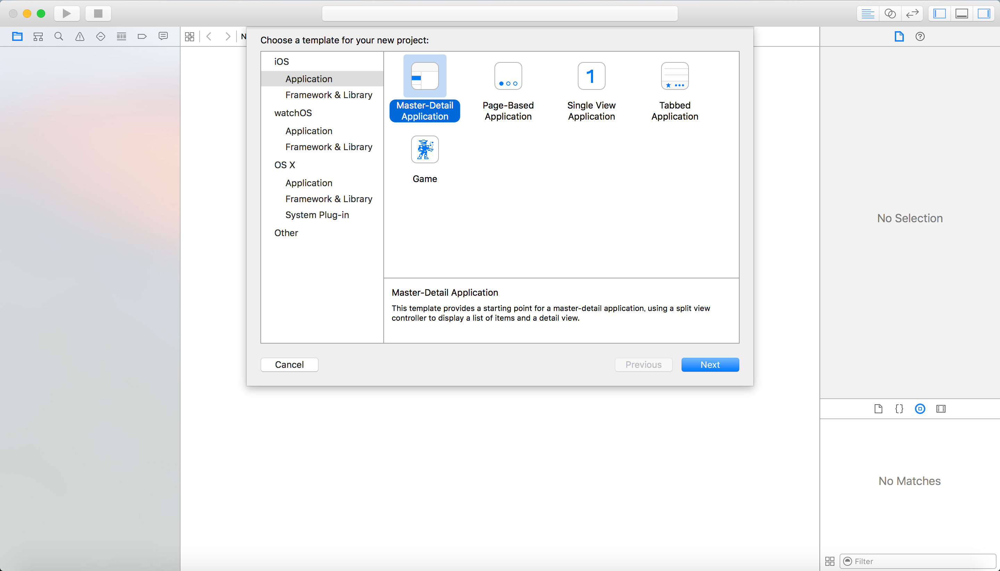
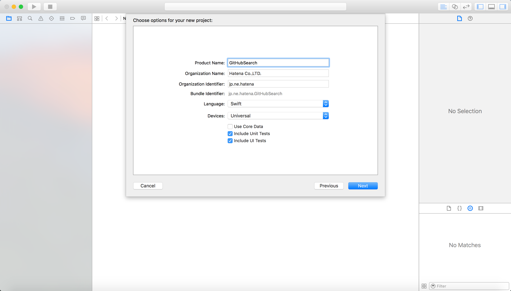
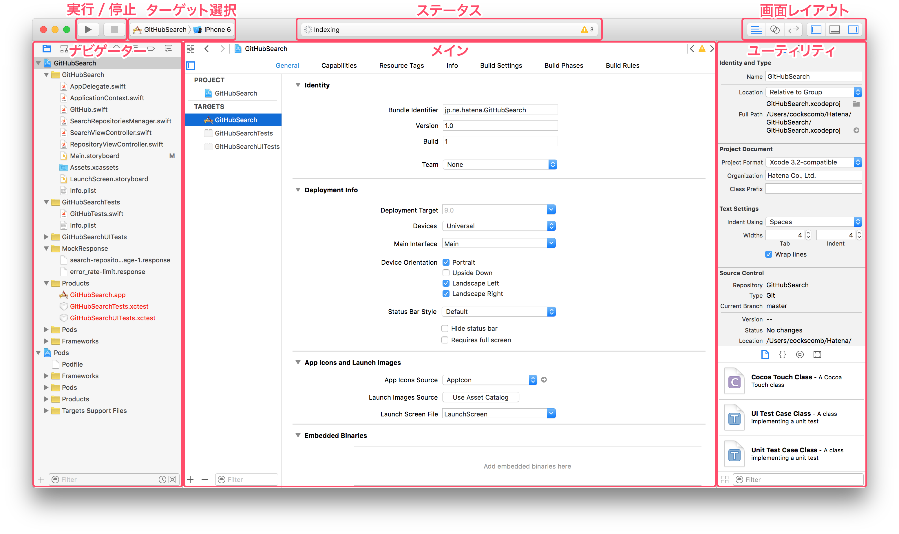
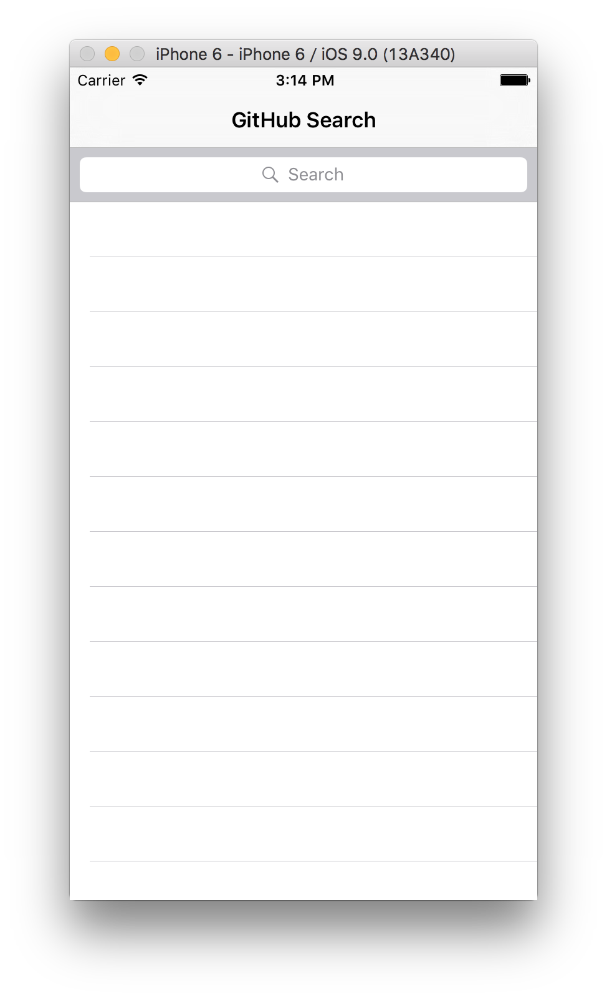
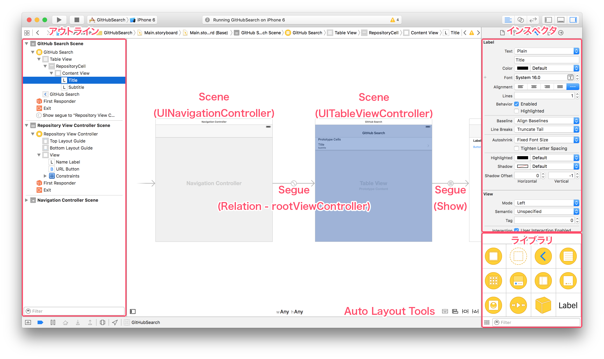
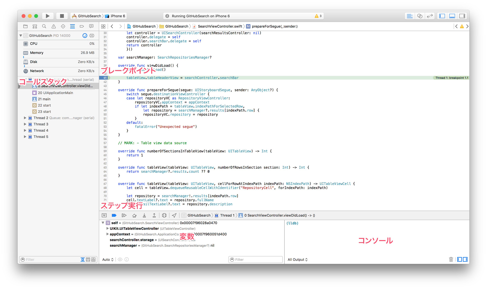

# Swift での iOS アプリ開発

プログラミング言語 Swift で iOS アプリを作る。iOS アプリは Apple が整備する Cocoa touch と呼ばれるフレームワーク群を利用して構成される。Cocoa touch の主要なフレームワークは `Foundation` と `UIKit` である。`Foundation` は文字列やコレクションといった基本的なクラスから、並行処理やネットワーク処理のためのクラスまで、基本的なツールが揃っている。また `Foundation` は iOS だけでなく、OS X や watchOS においても主要なフレームワークである。 `UIKit` は iOS の GUI フレームワークであり、アプリケーションを構成するための重要な機能のほとんどを担っている。GUI フレームワークはプラットフォーム毎に異なるものが用意されており、OS X では `AppKit`、watchOS では `WatchKit` を用いる。ただし tvOS においては `UIKit` の多くがそのまま利用でき、加えて `TVMLKit` というサーバーから配信されたマークアップ言語で GUI を構築できる仕組みも備えている。

## アーキテクチャ

はじめにアプリ全体をどのように構成するか検討する。iOS の `UIKit` フレームワークも一般的な MVC の考え方を踏襲しているが、_ViewController_ が非常に大きな役割を果たす。

### ViewController

ViewController は `UIViewController` のサブクラスで、自身が管理するひとつの View (`UIView`) を持つ。ViewController は管理下の View を更新し、また View において発生したイベントを受け取ってハンドリングする。必要に応じて Model を変更したり、あるいは Model の状態を View に反映させたりする。

ViewController は childViewController を持つことができる。アプリの中では、`UIWindow` が持つ単一の `rootViewController` の下に必要に応じて複数の ViewController が重なり、あるいは遷移して、アプリの機能を提供する。

### View

View は画面の表示を司るコンポーネントである。iOS アプリにおいては `UIView` とそのサブクラスが View である。View は subview を内包することができ、ほとんどの場合は複数の View が重なり合って画面を構成する。アプリは原則的にひとつのウインドウ (`UIWindow`) を持ち、その上に必要な View をいくつも載せていく。

View には ViewController によって直接的に管理されるものと、その subview として表示されるだけの ViewController と対応しない View がある。そのような ViewController や View の階層によってアプリの画面は構築されている。

```
┌──────────UIWindow──────────┐
│ ┌─────────UIView───────────┴┐     ┏━━━━━━━━━━━━━━━━━━━━━━━━━━━━┓
│ │                           │     ┃                            ┃
│ │                           │     ┃      UIViewController      ┃
│ │                           ◀─────┃   (root view controlelr)   ┃──┐
│ │                           │     ┃                            ┃  │
│ │                           │     ┗━━━━━━━━━━━━━━━━━━━━━━━━━━━━┛  │
│ │ ┌─────────UIView──────────┴─┐   ┏━━━━━━━━━━━━━━━━━━━━━━━━━━━━┓  │
│ │ │                           │   ┃                            ┃  │
│ │ │                           │   ┃      UIViewController      ┃  │
│ │ │ ┌───UILabel───┐           ◀───┃  (child view controlelr)   ┃◀─┘
│ │ │ └─────────────┘           │   ┃                            ┃
│ │ │ ┌─UIImageView─┐           │   ┗━━━━━━━━━━━━━━━━━━━━━━━━━━━━┛
│ │ │ │             │           │
│ │ │ │             │           │
│ │ │ │             │           │
│ │ │ │             │           │
│ │ │ └─────────────┘           │
│ │ │                           │
│ │ │                           │
│ │ │                           │
│ │ │                           │
│ │ │                           │
│ │ │                           │
│ │ │                           │
│ │ │                           │
│ │ │                           │
│ │ │                           │
│ │ │                           │
└─┤ │                           │
  └─┤                           │
    └───────────────────────────┘
```

また View は、ただ何かを表示するだけのコンポーネントではなく、画面上のイベント (`UIEvent`) を受け取る。イベントは View や ViewController をだんだんと伝播していく。イベントを受け取って伝播させる役割のオブジェクトをレスポンダーと呼び、 `UIResponder` クラスによって抽象化されている。実際に `UIView` や `UIViewController` は `UIResponder` を継承している。 このレスポンダーによるイベントの伝播をレスポンダーチェインと呼ぶ。

### Model

Model はアプリケーションの中心を成す、主としてビジネスロジックを担う部分である。データやリソースを抽象化したデータモデルとしての役割も持つ。基本的にはほとんどのロジックはここに集約されるべきであり、また単体テストがしやすいコンポーネントである。

モデルの役割は広く、必要に応じてより細分化された名前で呼ぶことになるかもしれない。しかし以下では View や ViewController に相当するもの以外のほとんどすべてを、単にモデルであるとみなす。

## チュートリアル:『GitHubSearch』アプリを作る

ここから、実際に Swift 言語で iOS アプリを作ってみる。例として GitHub の検索 API をとりあげ、GitHub のリポジトリを検索できるアプリを作ってみる。

完成しているサンプルコードが GitHub に公開されているので、適宜参照すること。

https://github.com/hatena/swift-Sample-GitHubSearch

### プロジェクト作成

Xcode から新しくプロジェクトを作る。



テンプレートの選択を求められるので、今回は _Master-Detail Application_ を選んで Next。



適当なディレクトリを選択して保存する。



ここで `.gitignore` を適切に設定する。[GitHub の `.gitignore`](https://github.com/github/gitignore/blob/master/Swift.gitignore) をコピーするのが手早い。

### CocoaPods で依存ライブラリ管理

外部のライブラリを管理するのに [CocoaPods](http://cocoapods.org/) を使う。下記のような `Gemfile` を置いて `bundle install` する。以降は `bundle exec pod` で `pod` コマンドを利用する。

```ruby
source 'https://rubygems.org'

gem 'cocoapods'
```

`bundle exec pod init` すると空の `Podfile` ができる。ここに必要なライブラリを書く。テストにだけ必要なライブラリなどは target 毎に書くとよい。

```ruby
platform :ios, '9.0'

use_framework!

pod 'AFNetworking'
```

ここでは `AFNetworking` という、ネットワーク通信を簡単にするためのライブラリを使ってみる。ファイルを保存したらそのディレクトリで `bundle exec pod install` する。

ここで一度 Xcode のプロジェクトを閉じて、プロジェクトと同じディレクトリの `.xcworkspace` という拡張子のファイルを開く。開くと左サイドバーのプロジェクトナビゲーターに、元々あるプロジェクトに加えて Pods というプロジェクトが表示される。こうすることで、アプリをビルドするときに CocoaPods 管理下のライブラリを同時にビルドできる。

### Build

アプリを build するとソースコードがコンパイルされる。Xcode 左上の Run を押すことで、build して選択したターゲットデバイスでアプリを起動できる。



Run するとデバッグ用の build が行われ（最適化が省略されたり、開発用のバイナリになる）、自動的にデバッガーが接続される。止めるときは Xcode 左上の Stop を押す。

アプリの開発中はこのような工程を何度も行って、少しずつアプリを作る。必要に応じて iOS Simulator や USB で接続された iOS の実機をターゲットデバイスとして選ぶ。

### `ViewController` 作成と Storyboard

アプリの UI は Storyboard ファイルを使って作っていく。Storyboard は Xcode の Interface Builder 機能を用いてグラフィカルに編集可能である。Storyboard 上には ViewController が並べられ、その View を編集して UI を作る。また ViewController 同士を Segue (`UIStoryboardSegue`) と呼ばれる線で繋ぐことで、画面の遷移などを表現する。

まずは最初から追加されている `Main.storyboard` ファイルを開く。ここには `UINavigationController` と `UITableViewController` のふたつの ViewController が配置されている。`UINavigationController` は、ドリルダウンする画面遷移を含んだナビゲーションのための ViewController で、今回は何もせずそのまま利用する。`UITableViewController` は `UITableView` というリスト表示を管理する ViewController で、今回のアプリの最初の画面になる。これをカスタマイズしたいので、ファイルメニューから新しい Swift ファイルを作成し、`SearchViewController` という `UITableViewController` を継承した ViewController を作る。Interface Builder の右側のインスペクタは、選択中の要素の詳細を変更できる。Identifier Inspector タブから、`UITableViewController` に Custom Class としていま作った `SearchViewController` を設定する。



`UINavigationController` の `rootViewController` relationship segue が `SearchViewController` に繋がっているので、最初にこの画面が表示される。Storyboard 上の `SearchViewController` には、いまひとつだけプロトタイプとなる `UITableViewCell` が用意されている。このセルを選択したときの動作を、`UIStoryboardSegue` という画面遷移を表したオブジェクトで表現できる。Storyboard 上にもう一つ ViewController を設置し、副ボタンドラッグで _Show_ Segue を接続する。

### API とネットワーク通信

ここから [GitHub のリポジトリ検索 API](https://developer.github.com/v3/search/#search-repositories) を利用する。

`https://api.github.com/search/repositories?q=Hatena&page=1` というような URL で以下のような JSON を返す。

```json
{
  "total_count": 583,
  "incomplete_results": false,
  "items": [
    {
      "id": 3946028,
      "name": "Hatena-Textbook",
      "full_name": "hatena/Hatena-Textbook",
      "owner": {
        "login": "hatena",
        "id": 14185,
        "avatar_url": "https://avatars.githubusercontent.com/u/14185?v=3",
        "gravatar_id": "",
        "url": "https://api.github.com/users/hatena",
        "html_url": "https://github.com/hatena",
        "type": "Organization"
      },
      "private": false,
      "html_url": "https://github.com/hatena/Hatena-Textbook",
      "description": "はてな研修用教科書",
      "fork": false,
      "url": "https://api.github.com/repos/hatena/Hatena-Textbook",
      "created_at": "2012-04-06T02:04:23Z",
      "updated_at": "2015-08-02T04:44:15Z",
      "pushed_at": "2015-02-26T06:30:33Z",
      "homepage": "",
      "size": 614,
      "stargazers_count": 879,
      "watchers_count": 879,
      "language": null,
      "forks_count": 72,
      "open_issues_count": 2,
      "forks": 72,
      "watchers": 879,
      "default_branch": "master",
      "score": 36.982796
    },
    ...
  ]
}

```

iOS アプリからの HTTP 通信では、`NSURLRequest` を `NSURLSession` を介して送信してレスポンスを得る。レスポンスは `NSURLResponse` かそのサブクラスの `NSHTTPURLResponse` で、レスポンスデータはバイナリの `NSData` である。`NSJSONSerialization` を利用することでバイナリから JSON の内容を得られる。 これらは全て Foundation.framework が提供する機能である。

ここでは単純化するために AFNetworking という非常によく使われているサードパーティーのライブラリを使う。AFNetworking の `AFHTTPSessionManager` を利用すると、上記のように `NSURLSession` を使う通信が簡単に書ける。

以下のように GitHub API を抽象化していく。

```swift
public typealias JSONObject = [String: AnyObject]

public enum HTTPMethod {
    case Get
}

public protocol JSONDecodable {
    init(JSON: JSONObject) throws
}

public protocol APIEndpoint {
    var path: String { get }
    var method: HTTPMethod { get }
    var parameters: Parameters { get }
    typealias ResponseType: JSONDecodable
}

public struct Parameters: DictionaryLiteralConvertible {
    public private(set) var dictionary: [String: AnyObject] = [:]
    public typealias Key = String
    public typealias Value = AnyObject?
    /**
    Initialized from dictionary literals
    */
    public init(dictionaryLiteral elements: (Parameters.Key, Parameters.Value)...) {
        for case let (key, value?) in elements {
            dictionary[key] = value
        }
    }
}

public class GitHubAPI {
    private let HTTPSessionManager: AFHTTPSessionManager = {
        let manager = AFHTTPSessionManager(baseURL: NSURL(string: "https://api.github.com/"))
        manager.requestSerializer.setValue("application/vnd.github.v3+json", forHTTPHeaderField: "Accept")
        return manager
        }()

    public init() {
    }

    public func request<Endpoint: APIEndpoint>(endpoint: Endpoint, handler: (task: NSURLSessionDataTask, response: Endpoint.ResponseType?, error: ErrorType?) -> Void) {
        let success = { (task: NSURLSessionDataTask!, response: AnyObject!) -> Void in
            if let JSON = response as? JSONObject {
                do {
                    let response = try Endpoint.ResponseType(JSON: JSON)
                    handler(task: task, response: response, error: nil)
                } catch {
                    handler(task: task, response: nil, error: error)
                }
            } else {
                handler(task: task, response: nil, error: APIError.UnexpectedResponse)
            }
        }
        let failure = { (task: NSURLSessionDataTask!, error: NSError!) -> Void in
            handler(task: task, response: nil, error: error)
        }

        switch endpoint.method {
        case .Get:
            HTTPSessionManager.GET(endpoint.path, parameters: endpoint.parameters.dictionary, success: success, failure: failure)
        }
    }
}
```

https://github.com/hatena/swift-Sample-GitHubSearch/blob/e6a1c89e5ac7d967fab2f61466b64a239aa10537/GitHubSearch/GitHub.swift#L27-L117

このとき `GitHubAPI` は API と通信する `request` メソッドを持った class である。状態として `AFHTTPSessionManager` を持ち、これが全ての通信を管理している。API の個々のエンドポイントは `protocol APIEndpoint` によって抽象化される。エンドポイントの情報を利用して通信を行い、その結果を非同期に返している。エンドポイントの抽象化は、URL のパスや、HTTP メソッド、リクエストのパラメーターを提供するだけでなく、レスポンスとしてどのようなデータ構造が返ってくるのかを `ResponseType` 型パラメータで示す。この型パラメータは `protocol JSONDecodable` に準拠している必要があり、JSON データから初期化可能であることを表している。

```swift
public struct SearchRepositories: APIEndpoint {
    public var path = "search/repositories"
    public var method = HTTPMethod.Get
    public var parameters: Parameters {
        return [
            "q" : query,
            "page" : page,
        ]
    }
    public typealias ResponseType = SearchResult<Repository>

    public let query: String
    public let page: Int

    public init(query: String, page: Int) {
        self.query = query
        self.page = page
    }
}
```

https://github.com/hatena/swift-Sample-GitHubSearch/blob/e6a1c89e5ac7d967fab2f61466b64a239aa10537/GitHubSearch/GitHub.swift#L124-L151

`APIEndpoint` に準拠したエンドポイントを表す struct を上記のように作る。`ResponseType` として指定されている `SearchResult` は以下のような実装である。

```swift
public struct SearchResult<ItemType: JSONDecodable>: JSONDecodable {
    public let totalCount: Int
    public let incompleteResults: Bool
    public let items: [ItemType]

    public init(JSON: JSONObject) throws {
        self.totalCount = try getValue(JSON, key: "total_count")
        self.incompleteResults = try getValue(JSON, key: "incomplete_results")
        self.items = try (getValue(JSON, key: "items") as [JSONObject]).map { return try ItemType(JSON: $0) }
    }
}

public enum JSONDecodeError: ErrorType {
    case MissingRequiredKey(String)
    case UnexpectedType(key: String, expected: Any.Type, actual: Any.Type)
}

private func getValue<T>(JSON: JSONObject, key: String) throws -> T {
    guard let value = JSON[key] else {
        throw JSONDecodeError.MissingRequiredKey(key)
    }
    guard let typedValue = value as? T else {
        throw JSONDecodeError.UnexpectedType(key: key, expected: T.self, actual: value.dynamicType)
    }
    return typedValue
}
```

https://github.com/hatena/swift-Sample-GitHubSearch/blob/e6a1c89e5ac7d967fab2f61466b64a239aa10537/GitHubSearch/GitHub.swift#L156-L418

`getValue` 関数は JSON オブジェクトから特定のキーの値を取り出す。このとき、型パラメータ `T` に適合するかどうか検査する。キーに対応する値がないか、あるいは `T` に適合しないとき `JSONDecodeError` を throw する。`T` は明示的に指定することもできるが、今回のようなケースでは型推論を活用するのがスマートである。

上記のようなコードを丁寧に構成していくことで、API から JSON のデータを取得し、これを型付けのためのオブジェクトにマッピングすることができる。

### 検索結果の管理

次に、検索結果が複数のページにわたることも考慮し、検索結果を管理する class を作っておく。

```swift
class SearchRepositoriesManager {

    let github: GitHubAPI
    let query: String

    var networking: Bool = false

    var results: [Repository] = []
    var completed: Bool = false
    var page: Int = 1

    init?(github: GitHubAPI, query: String) {
        self.github = github
        self.query = query
        if query.characters.isEmpty {
            return nil
        }
    }

    func search(reload: Bool, completion: (error: ErrorType?) -> Void) -> Bool {
        if completed || networking {
            return false
        }
        networking = true
        github.request(GitHubAPI.SearchRepositories(query: query, page: reload ? 1 : page)) { (task, response, error) in
            if let response = response {
                if reload {
                    self.results.removeAll()
                    self.page = 1
                }
                self.results.extend(response.items)
                self.completed = response.totalCount <= self.results.count
                self.page++
            }
            self.networking = false
            completion(error: error)
        }
        return true
    }

}
```

https://github.com/hatena/swift-Sample-GitHubSearch/blob/e6a1c89e5ac7d967fab2f61466b64a239aa10537/GitHubSearch/SearchRepositoriesManager.swift

検索に必要な `GitHubAPI` や検索クエリはイニシャライザで受け取ることにする。クエリ文字列が空文字のときは nil を返す failable initializer とした。

`search` メソッドは実際に検索 API から結果を取得するメソッドで、実際の処理は非同期に実行されて、処理の終了をコールバックに伝える。このとき自動的にページング処理を行うほか、すでに通信中であれば二重に通信しないように呼び出しを無視するといったような、細々とした調整を行う。検索結果は `result: [Repository]` に格納する。

### `UITableView`

ここで検索結果を表示する画面を作っていく。事前に作っておいた `UITableViewController` のサブクラス `SearchViewController` を開く。

`UITableView` への表示は、`UITableViewDataSource` と `UITableViewDelegate` のふたつのデリゲートを実装することで行う。iOS アプリの実装ではこのようなデリゲートパターンを多用する。

`protocol UITableViewDataSource` は、`UITableView` に表示する内容を提供するためのものである。必ず実装しなければならないふたつのメソッドがあり、`func tableView(_:numberOfRowsInSection:)` は行数を返し、`func tableView(_:cellForRowAtIndexPath:)` においてそれぞれの行 (Cell) を返す。

`protocol UITableViewDelegate` は内容を提供する以外の様々な役割を果たす。例えば特定の行がこれから表示されることを伝える `func tableView(_:willDisplayCell:forRowAtIndexPath:)` などがある。

`SearchViewController` でもこれらを実装していく。

```swift
override func tableView(tableView: UITableView, numberOfRowsInSection section: Int) -> Int {
    return searchManager?.results.count ?? 0
}

override func tableView(tableView: UITableView, cellForRowAtIndexPath indexPath: NSIndexPath) -> UITableViewCell {
    let cell = tableView.dequeueReusableCellWithIdentifier("RepositoryCell", forIndexPath: indexPath)
    let repository = searchManager!.results[indexPath.row]
    cell.textLabel?.text = repository.fullName
    cell.detailTextLabel?.text = repository.description
    return cell
}
```

https://github.com/hatena/swift-Sample-GitHubSearch/blob/e6a1c89e5ac7d967fab2f61466b64a239aa10537/GitHubSearch/SearchViewController.swift#L63-L75

`SearchViewController` は `SearchRepositoriesManager` のインスタンスを持っており、`results: [repository]` のデータを表示する。行の個数は `results` の `count` メソッドを利用する。`UITableViewCell` は、Storyboard 上で `"RepositoryCell"` という reuse identifier の `UITableViewCell` を用意しておいて、これにテキストを設定して返す。`UITableView` では非常に長大な行数のリストを表示できるように、行を表す `UITableViewCell` のインスタンスを再利用している。

このような実装を用意しておけば、あとは `SearchRepositoriesManager` で検索するだけである。ここでは `UISearchBar` という検索に使うフィールドを置いて、その `UISearchBarDelegate` を実装する。

```swift
class SearchViewController: UITableViewController, ApplicationContextSettable {

    var appContext: ApplicationContext!

    lazy var searchController: UISearchController = {
        let controller = UISearchController(searchResultsController: nil)
        controller.delegate = self
        controller.searchBar.delegate = self
        return controller
        }()

    var searchManager: SearchRepositoriesManager?

    override func viewDidLoad() {
        super.viewDidLoad()

        tableView.tableHeaderView = searchController.searchBar
    }

    ...
}

extension SearchViewController: UISearchBarDelegate {
    func searchBarTextDidEndEditing(searchBar: UISearchBar) {
        guard let searchText = searchBar.text else { return }
        guard let searchManager = SearchRepositoriesManager(github: appContext.github, query: searchText) else { return }
        self.searchManager = searchManager
        searchManager.search(true) { [weak self] (error) in
            if let error = error {
                print(error)
            } else {
                self?.tableView.reloadData()
                self?.searchController.active = false
            }
        }
    }
}
```

https://github.com/hatena/swift-Sample-GitHubSearch/blob/e6a1c89e5ac7d967fab2f61466b64a239aa10537/GitHubSearch/SearchViewController.swift#L25-L42

https://github.com/hatena/swift-Sample-GitHubSearch/blob/e6a1c89e5ac7d967fab2f61466b64a239aa10537/GitHubSearch/SearchViewController.swift#L96-L109

`UIViewController` はそのライフサイクルと共にメソッドが呼び出される。よく使われるのは以下のようなものである。

- `loadView()`
- `viewDidLoad()`
- `viewWillAppear(_:)`
- `viewDidAppear(_:)`
- `viewWillDisappear(_:)`
- `viewDidDisappear(_:)`

今回は View の構築が完了した `viewDidLoad()` で `UISearchBar` を画面に追加している。

通信の完了後に `tableView.reloadData()` とすることで、`UITableView` にデータの更新があることを伝えている。

### 画面遷移

Cell が選択されたら画面遷移をして、詳細が表示されるようにしていく。Storyboard 上に新しく ViewController を追加し、Custom Class で `UIViewController` の適当なサブクラスを設定する。`SearchViewController` 上の Cell から "Show" Segue を伸ばして、新しい ViewController と接続する。これで Cell が選択されたら新しい画面に遷移するようになる。

`prepareForSegue(_:sender:)` メソッドで、遷移先の画面に情報を渡すことができる。

```swift
override func prepareForSegue(segue: UIStoryboardSegue, sender: AnyObject?) {
    switch segue.destinationViewController {
    case let repositoryVC as RepositoryViewController:
        if let indexPath = tableView.indexPathForSelectedRow,
            let repository = searchManager?.results[indexPath.row] {
            repositoryVC.repository = repository
        }
    default:
        fatalError("Unexpected segue")
    }
}
```

https://github.com/hatena/swift-Sample-GitHubSearch/blob/e6a1c89e5ac7d967fab2f61466b64a239aa10537/GitHubSearch/SearchViewController.swift#L44-L55

`UIStoryboardSegue` の `destinationViewController` プロパティで遷移先の ViewController への参照が得られる。この ViewController の型を確認して、選択された Cell に表示されていた `Repository` を渡す。

遷移先の ViewController として用意した `RepositoryViewController` では `Repository` のデータを表示する。

```swift
class RepositoryViewController: UIViewController {
    var repository: Repository!

    @IBOutlet weak var nameLabel: UILabel!
    @IBOutlet weak var URLButton: UIButton!

    override func viewDidLoad() {
        super.viewDidLoad()
        title = repository.name
        nameLabel.text = repository.fullName
        URLButton.setTitle(repository.HTMLURL.absoluteString, forState: .Normal)
    }

    @IBAction func openURL(sender: AnyObject) {
        let safari = SFSafariViewController(URL: repository.HTMLURL)
        safari.delegate = self
        presentViewController(safari, animated: true, completion: nil)
    }
}

extension RepositoryViewController: SFSafariViewControllerDelegate {
    func safariViewControllerDidFinish(controller: SFSafariViewController) {
        controller.dismissViewControllerAnimated(true, completion: nil)
    }
}
```

https://github.com/hatena/swift-Sample-GitHubSearch/blob/e6a1c89e5ac7d967fab2f61466b64a239aa10537/GitHubSearch/RepositoryViewController.swift

ここでプロパティに `@IBOutlet`、メソッドに `@IBAction` といったアノテーションを付けているものがある。これらは Storyboard 上に配置された UI コンポーネントと接続できる。`@IBOutlet` は参照で、`@IBAction` はボタンなどのイベントのハンドラになる。これらはアプリの実行時に動的に解決される。Storyboard 上の関連づけたい View から副ボタンドラッグを行い、適切にこれらを設定しておく。

これらの参照を利用して `viewDidLoad()` で View の表示を更新する。またボタンがクリックされたときには Web ページを表示している。

---

## 課題

課題では、これまで作ってきた `Intern::Diary` の iOS アプリを作る。JavaScript の課題で作っているはずの JSON API をなるべく使い回すとよい。一からアプリを作成し、できれば実機で動作させる。

### 課題

iOS アプリで記事一覧を表示できるようにする。表示には `UITableView` を使うこと。また個別の記事を選択したとき、個別の記事画面に遷移するようにすること。

### オプション課題

iOS アプリから記事を投稿できるようにする。必要に応じて API も作成すること。

### 自由課題

創意工夫をしてよりよいアプリにする。

---

## 追補

### デバッグ

iOS/OS X プログラミングにおけるデバッグの手法を簡単に紹介する。

#### `print`

ログを出してデバッグする。原始的な方法ではあるが柔軟でもある。

```swift
let dict = [ "a" : "b" ]
print("Dictionary: \(dict)")
```

必要に応じて `CustomStringConvertible` などを実装しておくとよい。

#### デバッガとブレークポイント

ブレークポイントを設定することで、実行中のプログラムを特定の位置で止めることができる。Xcode から GUI でブレークポイントを操作できる。



例外発生時に止まるブレークポイントを設定することができ、例外の原因を辿りやすくなる。

#### Instruments

Xcode に付属する Instruments を使うと、さらに高度な解析が簡単に行える。メモリリークの発見やパフォーマンスのチューニングなど、様々に利用できる。詳しくはドキュメントを参照。

- [Instruments User Guide](https://developer.apple.com/library/ios/#documentation/DeveloperTools/Conceptual/InstrumentsUserGuide/Introduction/Introduction.html)
- [日本語ドキュメント](https://developer.apple.com/jp/devcenter/ios/library/japanese.html)の「Instruments ユーザガイド」


<a rel="license" href="http://creativecommons.org/licenses/by-nc-sa/2.1/jp/"></a><br />この 作品 は <a rel="license" href="http://creativecommons.org/licenses/by-nc-sa/2.1/jp/">クリエイティブ・コモンズ 表示 - 非営利 - 継承 2.1 日本 ライセンスの下に提供されています。</a>
